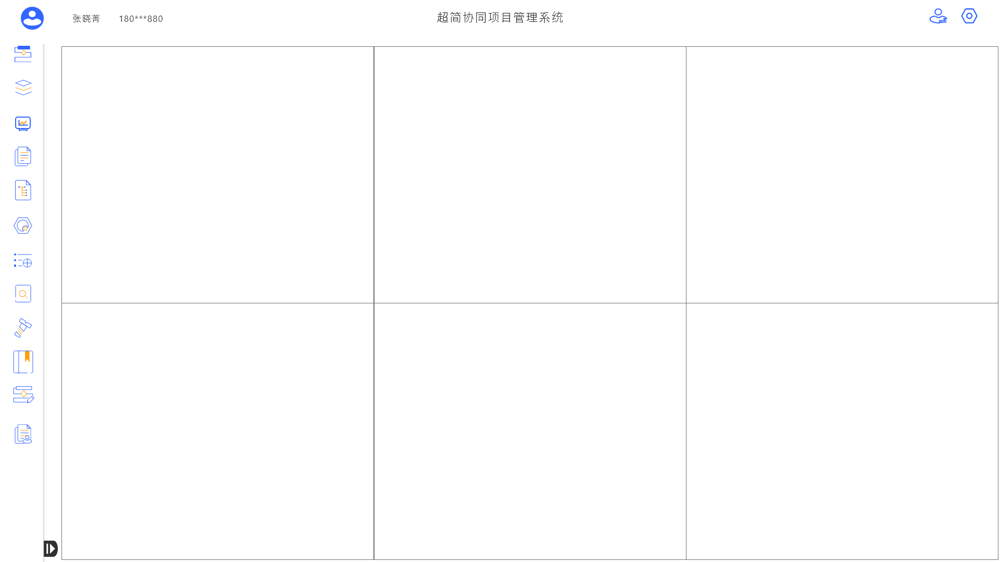
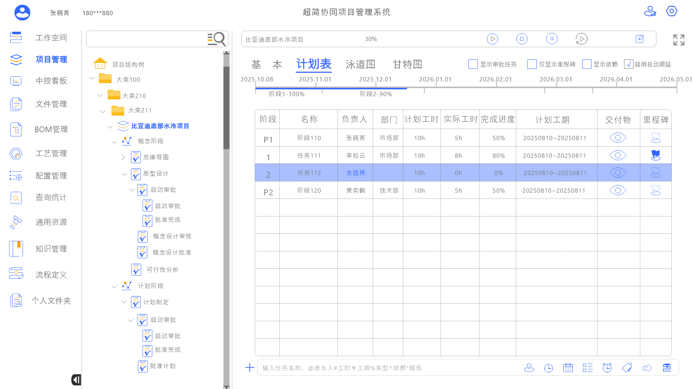
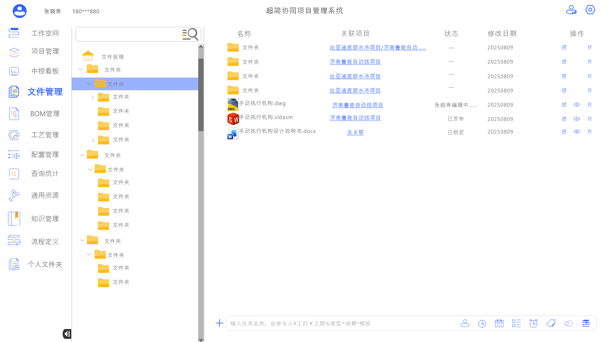
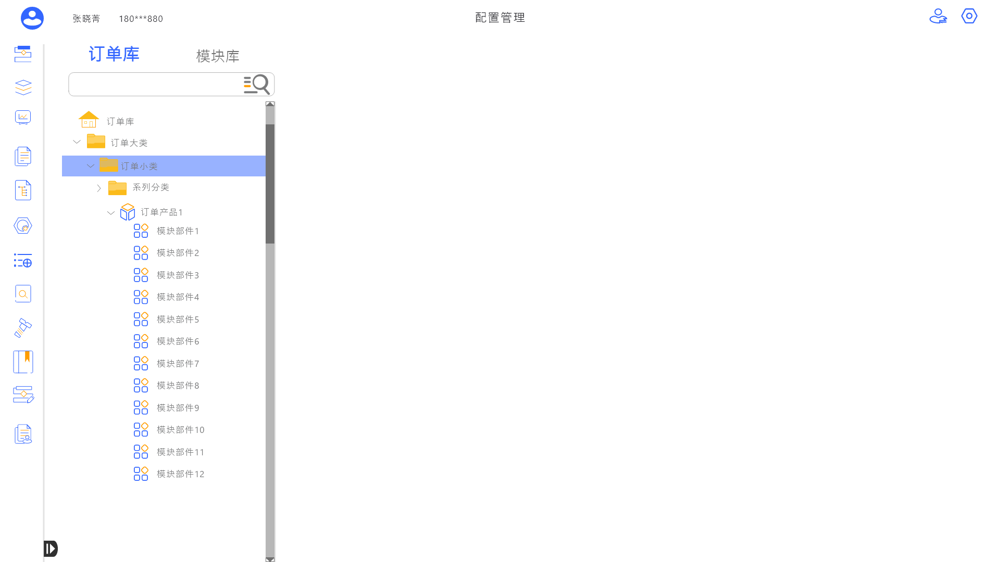
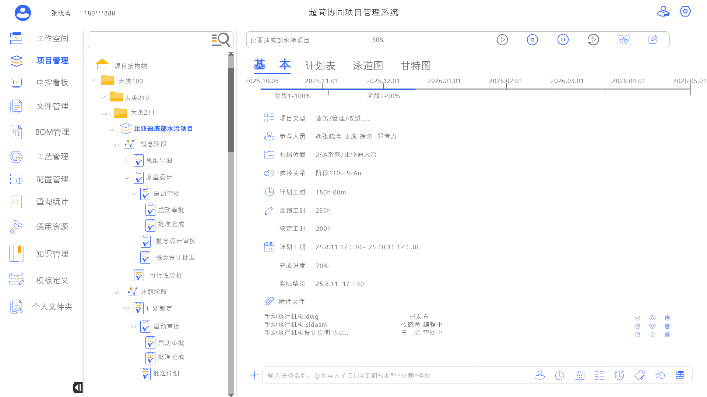
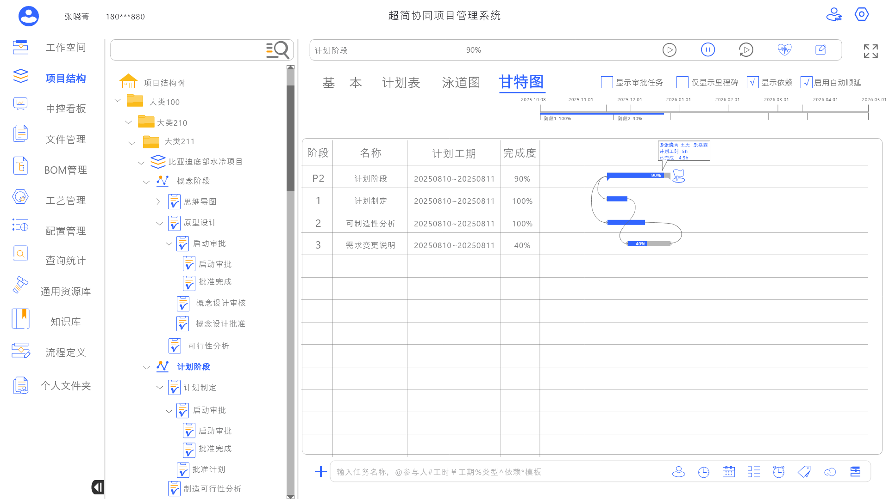
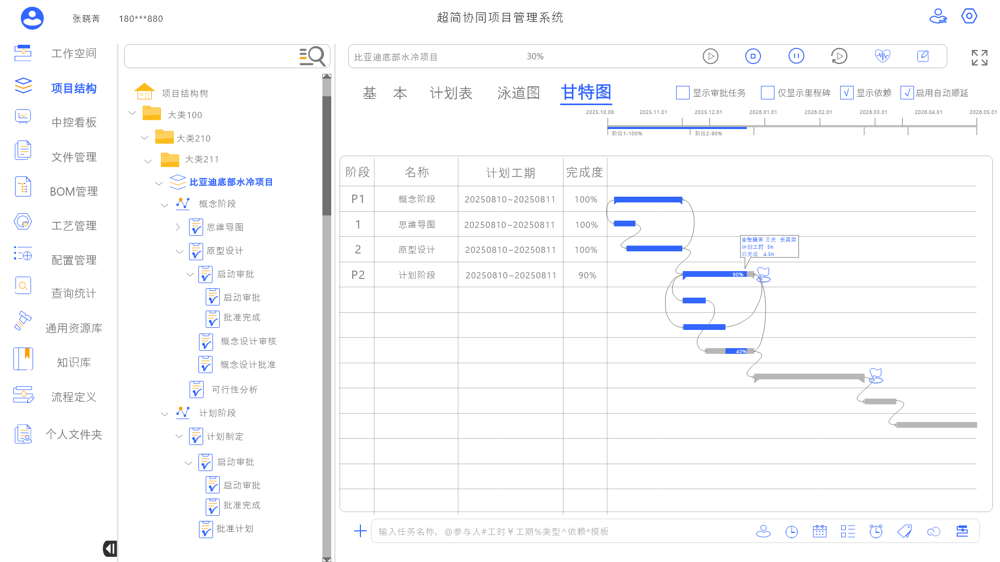
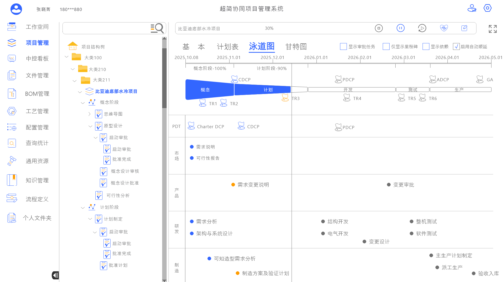
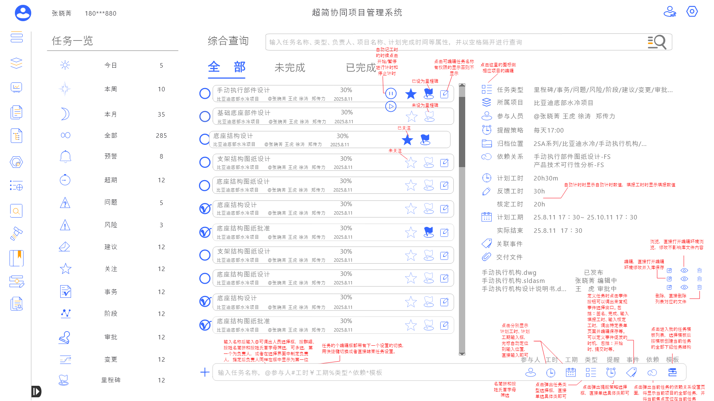
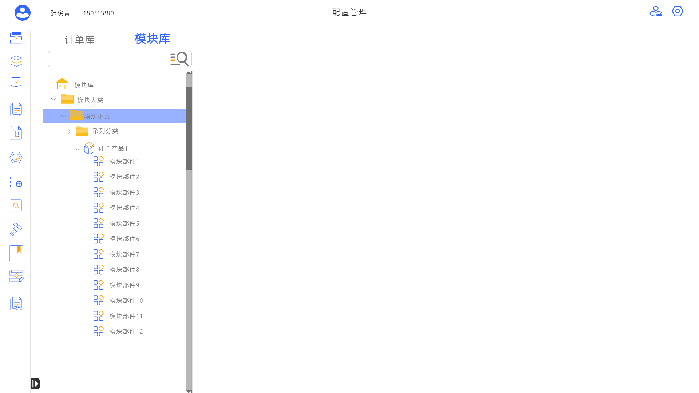

# SyncFlow 超简协同项目管理系统 — 产品设计概要

> 面向：项目经理、产品经理、管理层
> 版本：v1.0 | 日期：2026-05-01
> 基于：《SyncFlow 详细设计文档 v1.0》（2026-05-01）

---

## 执行摘要

SyncFlow 是面向工业制造领域的协同项目管理平台，目标是在 V1.0 版本（3 个月内）上线 5 个核心模块，为制造业团队提供基础的项目管理、任务协同和文件管理能力。后续通过 4 个阶段（约 12 个月）逐步增加工业专用模块、AI 智能能力和移动端支持，最终实现全场景覆盖的智能化项目管理平台。

**V1.0 核心交付范围**：中控看板、项目管理、待办事项、文件管理、配置管理
**预计完整产品周期**：12 个月（5 个版本阶段）
**关键差异化**：多层级项目树、工业标准阶段模型、AI 辅助决策

---

## 1. 产品概述

### 1.1 产品定位

SyncFlow 是一款面向**工业制造领域**的协同项目管理平台，专为制造业、新能源、汽车行业（尤其是电动汽车/电池领域）的复杂工程项目管理而设计。

**与通用项目管理工具的差异**：

| 维度 | 通用工具（Jira/Trello/飞书项目） | SyncFlow |
|------|-------------------------------|----------|
| 项目层级 | 扁平或简单二级结构 | 多层级项目树（可嵌套 7 层以上） |
| 项目阶段 | 自定义标签 | 预置工业标准阶段模型（调查/概念/计划/开发/测试/量产） |
| 协同对象 | 以软件开发团队为主 | 跨部门协同（设计/产品/研发/测试/管理层） |
| 专业模块 | 无 | 内置 BOM 管理、工艺管理等工业专用模块 |
| AI 能力 | 基础或无 | AI 辅助决策（进度预警、风险识别、资源优化） |

### 1.2 目标用户

| 角色 | 核心诉求 | 使用频率 |
|------|---------|---------|
| 项目经理 | 全局掌控项目进度、资源调配、风险管控 | 每日高频 |
| 产品/设计/研发工程师 | 任务管理、文件协同、进度反馈 | 每日高频 |
| 测试/工艺工程师 | 测试计划、工艺文件维护 | 按项目阶段 |
| 部门主管 | 部门任务分配、团队负荷监控 | 每日中频 |
| 高管/管理层 | 项目总览、战略决策、跨项目管控 | 每周/关键节点 |

### 1.3 核心价值

| 价值点 | 一句话说明 |
|--------|-----------|
| **跨部门协同** | 打破部门壁垒，实现设计、研发、测试、工艺等多部门在同一平台上的任务流转与协作 |
| **进度可视化** | 甘特图、看板、泳道图等多种视图直观展示项目进度，管理层一屏掌握全局 |
| **多层级项目管控** | 支持多层级项目树结构，从整车到零部件层层细分，每层独立管控又可汇总统计 |
| **AI 辅助决策** | 智能识别延期风险、分析团队负荷、推荐任务分配方案、自动生成周报/月报 |

---

## 2. 功能模块全景

SyncFlow 共包含 **12 个功能模块**，其中 6 个为核心模块（已完成 UI 设计），6 个为拓展模块（待设计）。

| 序号 | 模块名称 | 定位 | 核心功能 | V1优先级 | 备注 |
|------|---------|------|---------|----------|------|
| 01 | 中控看板 | 项目管理中枢 | 甘特排期总览、本周聚焦、预警监控、视图切换 | **P0** | 核心模块 |
| 02 | 项目管理 | 核心功能引擎 | 多视图项目排期、任务管理、里程碑追踪 | **P0** | 核心模块 |
| 03 | 待办事项 | 个人工作空间 | 任务聚合、状态管理、智能筛选、AI助手 | **P0** | 核心模块 |
| 04 | 文件管理 | 文件协同中心 | 集中存储、版本管理、在线预览、权限控制 | **P0** | 核心模块 |
| 05 | 配置管理 | 系统管理基础 | 组织架构、角色权限、成员管理、通知设置 | **P0** | 核心模块 |
| 06 | 我的任务 | 个人任务视图 | 任务总览、项目仪表盘、任务提醒 | **P1** | 核心模块 |
| 07 | 查询统计 | 数据分析平台 | 多维度查询、统计图表、报表导出 | **P1** | 拓展模块 |
| 08 | 模板定义 | 效率提升工具 | 项目模板、任务模板创建与应用 | **P1** | 拓展模块 |
| 09 | BOM管理 | 工业专用模块 | 物料清单管理、BOM树、版本与变更 | **P2** | 拓展模块 |
| 10 | 工艺管理 | 工业专用模块 | 工艺流程定义、工艺参数管理 | **P2** | 拓展模块 |
| 11 | 知识管理 | 知识沉淀平台 | 经验文档、最佳实践、全文搜索 | **P2** | 拓展模块 |
| 12 | 通用资源 | 资源共享平台 | 人力资源、设备资源、供应商管理 | **P2** | 拓展模块 |

> **优先级说明**：P0 = 必须上线（MVP 核心）、P1 = 重要（增强用户体验）、P2 = 可选（按需迭代）

---

## 3. 核心模块功能概览

### 3.1 中控看板 — 项目管理中枢

面向项目经理及管理层的全局监控中心。以**甘特图**形式一览所有项目排期，快速识别延期风险。支持「排期视图」与「看板视图」两种模式自由切换。

右侧信息面板提供**预警/风险/建议**计数、今日待办统计和超期提醒列表，帮助管理者第一时间发现并处理问题。底部本周任务区按工作日排列关键任务，聚焦本周重点工作。

通过多维度筛选（按公司、按进度状态），管理者可灵活调整查看视角，做到真正的"一屏掌控全局"。



---

### 3.2 项目管理 — 核心功能引擎

提供多维度视图的项目排期与任务管理能力，是整个系统的数据基石。

- **项目树导航**：支持最多 7 级层级的项目树结构（如 汽车 > 新能源 > 电池 > 电池Pack > 电池模组 > ...），快速定位任意项目节点
- **多视图切换**：计划表、任务甘特图、项目甘特图、泳道图等多种视图，满足不同角色的查看需求
- **进度追踪**：实时展示任务进度百分比与状态，支持拖拽调整排期
- **阶段管理**：预置工业标准阶段模型（调查 > 概念 > 计划 > 开发 > 测试 > 量产）



---

### 3.3 待办事项 — 个人工作空间

每位用户的个性化任务中心，汇聚所有项目中被分配的待办任务。

- **任务列表**：清晰展示任务名称、状态、优先级、负责人、截止日期和进度
- **智能筛选**：15 个预设筛选维度（今日/本周/本月/预警/超期/风险/里程碑等），支持组合筛选和实时搜索
- **AI 助手面板**：集成 AI 分析能力，自动统计任务完成率，按状态分类展示，并提供智能建议（如"建议优先处理即将到期的紧急任务"）
- **一键操作**：支持状态快速切换、进度更新、任务详情查看


---

### 3.4 文件管理 — 文件协同中心

项目文件的集中存储、版本管理和协同共享中心。

- **集中存储**：项目相关文件统一存储，支持文件夹层级结构，避免信息分散
- **类型管理**：按文档、图片、代码等类型分类筛选，支持搜索
- **版本控制**：支持多版本管理（最多 20 个历史版本），可回滚、可对比
- **权限管控**：三级权限（仅查看/可编辑/管理），支持分享和团队协作
- **空间统计**：实时显示存储用量，支持拖拽上传、批量操作



---

### 3.5 配置管理 — 系统管理基础

组织架构与权限体系的统一管理中心，是系统安全运行的基石。

- **组织建模**：按部门层级（如公司管理层/设计部/产品部/研发部/测试部）组织人员
- **角色权限**：每个部门下可定义多个角色，每个角色关联具体成员，实现基于角色的权限管控
- **成员管理**：支持添加/移除成员、搜索人员、批量操作
- **通知设置**：统一配置任务提醒策略（提醒时间、通知方式、频率控制）



---

### 3.6 我的任务 — 个人任务视图

用户个人任务的全生命周期管理视图，提供更全面的任务总览和财务指标。

- **指标仪表盘**：总任务数、已完成、进行中、待处理四项关键指标一目了然
- **财务卡片**：预计总收入与实际支出，辅助项目成本管控
- **项目总览表格**：所有关联项目的负责人、团队规模、完成度、时间范围
- **任务明细**：按状态、优先级筛选，支持关键词搜索


---

## 4. 设计规范概要

### 4.1 色彩系统

#### 主色

| 色彩角色 | 色值 | 使用场景 |
|---------|------|---------|
| 主色 | #3366FF | 主要按钮、链接、激活态、进度条 |
| 辅助色 | #FF9C00 | 进度指示、预警标识 |

#### 语义色

| 色彩角色 | 色值 | 使用场景 |
|---------|------|---------|
| 紧急/高优先级 | #FF4D4F | 紧急任务、错误状态、高优先级 |
| 进行中/中优先级 | #FAAD14 | 进行中状态、警告状态、中优先级 |
| 已完成/低优先级 | #52C41A | 已完成状态、成功状态、低优先级 |
| 待分配/未开始 | #8C8C8C | 待分配状态、禁用态 |
| 已延期 | #A0522D | 延期任务标识、超期警告 |
| 已取消 | #BFBFBF | 已取消状态 |

### 4.2 任务状态定义

| 状态 | 颜色 | 说明 |
|------|------|------|
| 待分配 | 灰色 | 任务已创建，等待分配责任人 |
| 未开始 | 灰色 | 任务已创建，尚未启动 |
| 进行中 | 黄色/橙色 | 任务已被领取并正在执行 |
| 暂停 | 棕色 | 任务因外部原因暂停 |
| 已完成 | 绿色 | 任务已完成并通过验收 |
| 已延期 | 红色 | 任务超过截止日期未完成 |
| 已取消 | 浅灰 | 任务被取消，不再执行 |
| 紧急 | 红色 | 标记为紧急，需立即处理 |

**状态流转路径**：

```
待分配 --> 未开始 --> 进行中 --> 已完成
                    |
                    v
                  暂停 --> 进行中
                    |
                    v
                  已取消

未开始/进行中 --> 已延期 --> 进行中 --> 已完成
任意状态 --> 紧急（优先级提升）
```

### 4.3 优先级定义

| 优先级 | 颜色 | 适用场景 |
|--------|------|---------|
| 紧急 | 红色 | 紧急任务，需立即响应 |
| 高 | 红色 | 关键路径任务、阻塞性任务 |
| 中 | 黄色 | 常规任务 |
| 低 | 绿色 | 非紧急任务、优化类任务 |

### 4.4 项目阶段定义

| 阶段 | 颜色 | 说明 |
|------|------|------|
| 调查 | 灰色 | 需求调研与可行性分析 |
| 概念 | 蓝色 | 概念设计与方案确定 |
| 计划 | 黄色 | 详细计划制定与资源分配 |
| 开发 | 橙色 | 产品开发与实现 |
| 测试 | 蓝色 | 测试验证与问题修复 |
| 量产 | 绿色 | 批量生产准备与上线 |

---

## 5. 数据模型概要

以下是系统核心实体之间的关系概览，帮助理解业务数据的整体结构。

```
                     ┌──────────┐
                     │  部门     │
                     │Department│
                     └────┬─────┘
                          │ 1:N（部门下有多个角色）
                          v
┌──────┐ M:N ┌──────┐ N:1 ┌──────┐
│ 用户  │────>│ 角色  │────>│ 部门  │
│ User │     │ Role │     │      │
└──┬───┘     └──────┘     └──────┘
   │
   ├── M:N ──> 团队（Team）           用户可属于多个团队
   │
   ├── 1:N ──> 项目（Project）         用户负责多个项目
   │               │
   │               ├── 自关联（树形）    项目可层层嵌套
   │               ├── 1:N ──> 任务     项目包含多个任务
   │               └── 1:N ──> 文件     项目包含多个文件
   │
   ├── 1:N ──> 任务（Task）            用户负责多个任务
   │               │
   │               ├── N:N ──> 任务     任务间可有依赖关系
   │               └── M:N ──> 用户     任务可有多位参与人
   │
   └── 1:N ──> 文件（File）            用户上传多个文件
                   │
                   └── 自关联（树形）    文件夹层级结构
```

**核心关系要点**：
- **用户** 是系统的核心实体，通过部门归属和角色分配实现权限管控
- **项目** 支持树形嵌套，适配工业领域多层级项目结构（如 汽车 > 新能源 > 电池 > ...）
- **任务** 依附于项目，支持任务间依赖关系和多人参与
- **文件** 可关联到项目（团队共享）或独立存在（个人文件）

---

## 6. 产品路线图

| 阶段 | 时间 | 内容 | 里程碑 |
|------|------|------|--------|
| **V1.0 MVP** | 第 1-3 月 | 核心模块：中控看板、项目管理、待办事项、文件管理、配置管理 | 基础项目管理能力上线，可支持团队日常任务管理与进度追踪 |
| **V1.5 增强** | 第 4-5 月 | 新增模块：我的任务、查询统计、模板定义；完善 AI 助手 | 完善个人工作台，实现数据驱动决策，提升团队使用效率 |
| **V2.0 扩展** | 第 6-8 月 | 工业专用模块：BOM 管理、工艺管理、知识管理 | 工业级专业模块上线，深度契合制造业项目管理需求 |
| **V2.5 智能** | 第 9-10 月 | AI 助手全面升级（智能排期、风险预测、自动报告）；自动化工作流 | 从"工具"进化为"智能助手"，显著降低管理成本 |
| **V3.0 生态** | 第 11-12 月 | 通用资源管理、个人文件夹、移动端适配；第三方系统集成 | 全场景覆盖，支持跨系统协作与移动办公 |

### V1.0 MVP 详细里程碑

| 里程碑 | 时间节点 | 交付物 | 验收标准 |
|--------|---------|--------|---------|
| M1 - 框架搭建 | 第 1 月上旬 | 技术框架搭建、设计系统落地、登录/注册流程 | 开发环境就绪，用户可正常登录系统 |
| M2 - 核心看板 | 第 1 月下旬 | 中控看板（排期视图 + 看板视图）、项目树导航 | 管理者可一屏查看所有项目状态 |
| M3 - 项目管理 | 第 2 月上旬 | 项目管理（计划表 + 甘特图 + 泳道图）、任务 CRUD | 可完成项目创建、排期和任务管理全流程 |
| M4 - 协同功能 | 第 2 月下旬 | 待办事项、文件管理（含版本管理）、配置管理 | 团队可基于系统进行日常任务协同和文件共享 |
| M5 - 集成测试 | 第 3 月上旬 | 全模块联调、性能优化、安全测试 | 所有核心流程走通，性能达标 |
| M6 - 正式发布 | 第 3 月下旬 | 文档完善、用户培训、灰度上线 | 首批用户成功上线并完成基础项目管理 |

### 路线图时间线

```
月:  1    2    3    4    5    6    7    8    9   10   11   12
     ├────┼────┼────┼────┼────┼────┼────┼────┼────┼────┼────┤
     │◄── V1.0 MVP ──►│◄─ V1.5 ─►│◄─── V2.0 ───►│◄─ V2.5 ─►│◄─ V3.0 ─►│
     │                 │          │              │          │          │
     │ 中控看板        │ 我的任务 │ BOM管理      │ AI升级   │ 移动端   │
     │ 项目管理        │ 查询统计 │ 工艺管理     │ 自动化   │ 通用资源 │
     │ 待办事项        │ 模板定义 │ 知识管理     │ 工作流   │ 个人文件 │
     │ 文件管理        │          │              │          │          │
     │ 配置管理        │          │              │          │          │
```

### 各阶段主要交付物

| 阶段 | 新增功能 | 质量目标 |
|------|---------|---------|
| V1.0 MVP | 5 个核心模块 + 登录注册 + 基础权限 | 核心流程零阻断，页面加载 < 2 秒 |
| V1.5 增强 | 3 个增强模块 + AI 基础能力 | 查询响应 < 1 秒，数据导出成功率 > 99% |
| V2.0 扩展 | 3 个工业专用模块 | 工业级 BOM/工艺数据准确率 100% |
| V2.5 智能 | AI 全面升级 + 工作流引擎 | AI 建议准确率 > 80%，自动化覆盖率 > 60% |
| V3.0 生态 | 移动端 + 资源管理 + 第三方集成 | 移动端核心功能可用，API 稳定性 > 99.9% |

---

## 7. 关键设计决策

| 序号 | 决策 | 理由 |
|------|------|------|
| 1 | **采用多层级项目树结构**（最多 7 级），而非扁平结构 | 工业制造项目天然具有层级特征（整车 > 系统 > 子系统 > 组件），扁平结构无法表达复杂的产品分解关系，也不利于多级汇总统计 |
| 2 | **预置工业标准阶段模型**（调查/概念/计划/开发/测试/量产），而非完全自定义 | 降低项目创建成本，统一团队语言，确保阶段管理符合行业规范；同时提供模板定义模块满足个性化需求 |
| 3 | **集成 AI 助手**作为核心差异化功能 | 帮助管理者快速识别风险、优化资源分配，从"被动查询"升级为"主动预警"；也是与竞品拉开差距的关键卖点 |
| 4 | **左侧边栏 + 顶栏 + 内容区**的三栏经典布局 | 降低用户学习成本，12 个功能模块通过左侧导航一目了然；行业主流方案，用户无需额外培训 |
| 5 | **统一设计系统**（色彩、状态、组件）贯穿所有模块 | 确保视觉一致性和用户体验连贯性，减少设计和开发成本，也有利于后续模块的快速迭代 |
| 6 | **中控看板作为入口页面**，而非项目列表 | 管理层最关心全局概览而非单一项目，首页即决策中心；信息密度高，减少页面跳转 |
| 7 | **文件管理独立模块化**，而非嵌入项目内部 | 工业项目文件量大、类型多（图纸/规格书/测试报告），需要独立的版本管理和权限体系；也可跨项目复用 |
| 8 | **采用渐进式模块上线策略**（MVP > 增强 > 扩展 > 智能 > 生态） | 控制首期交付风险，尽早获取用户反馈，按价值优先级逐步完善产品；每阶段可独立交付价值 |

---

## 8. 风险与待确认项

| 风险项 | 风险等级 | 业务影响 | 建议缓解措施 |
|--------|---------|---------|-------------|
| **AI 助手方案未确定** | 高 | AI 助手是核心卖点，但技术选型（自建/第三方）、成本控制、数据隐私合规等均未明确，直接影响产品定位和定价 | 尽快输出 AI 助手专项技术方案，明确模型选型、数据范围、成本预算和隐私策略 |
| **权限体系过于简单** | 高 | 工业项目涉及多部门、多角色、多层级管控，当前 RBAC 模型可能无法满足项目级、数据级的精细权限需求 | 输出完整的权限矩阵表，明确模块级/操作级/数据级三级权限体系 |
| **甘特图性能风险** | 中 | 大型工业项目可能有 1000+ 任务，甘特图渲染性能直接影响用户体验 | V1 即做好性能规划，采用虚拟化渲染和分页加载策略 |
| **移动端方案缺失** | 中 | 管理层和现场工程师有强烈的移动办公需求，但当前仅完成桌面端设计 | 明确 V1 是否需要移动端 MVP，如需要则尽早启动移动端设计 |
| **数据迁移路径未规划** | 中 | 客户通常已有 Excel/飞书/Jira 等数据积累，无缝迁移是上线推广的关键前提 | 提供标准化数据导入模板和迁移工具，降低客户切换成本 |

---

## 附录：设计稿索引

以下为已完成的 18 张 UI 设计稿，覆盖 6 个核心模块：

### 中控看板（2 张）

| 序号 | 设计稿 | 说明 |
|------|--------|------|
| 01 |  | 排期视图：甘特排期总览 + 右侧信息面板 + 本周任务区 |
| 02 |  | 看板视图：按工作流阶段组织的卡片式看板 |

### 项目管理（5 张）

| 序号 | 设计稿 | 说明 |
|------|--------|------|
| 03 |  | 基本视图：项目树 + 列表式项目概览 |
| 04 |  | 计划表视图：表格形式展示排期数据 |
| 05 |  | 任务甘特图：任务粒度的甘特排期视图 |
| 06 |  | 项目甘特图：项目粒度的甘特排期视图 |
| 07 |  | 泳道图：按人员/阶段划分的任务泳道视图 |

### 待办事项（4 张）

| 序号 | 设计稿 | 说明 |
|------|--------|------|
| 08 |  | 列表视图：AI 面板收起，任务列表全宽展示 |
| 09 |  | AI 建议展开版：显示详细 AI 分析与建议 |
| 10 |  | AI 助手紧凑版：标准宽度的 AI 分析面板 |
| 11 |  | AI 助手标准版：完整的 AI 摘要与指标卡片 |

### 文件管理（1 张）

| 序号 | 设计稿 | 说明 |
|------|--------|------|
| 12 |  | 文件列表视图：文件列表 + 类型筛选 + 存储统计 |

### 配置管理（2 张）

| 序号 | 设计稿 | 说明 |
|------|--------|------|
| 13 |  | 角色权限配置：部门-角色-成员三级管理 |
| 14 |  | 成员管理：添加/移除成员操作界面 |

### 我的任务（4 张）

| 序号 | 设计稿 | 说明 |
|------|--------|------|
| 15 |  | 项目总览仪表盘：指标卡片 + 财务卡片 + 项目表格 |
| 16 |  | 提醒设置：通知方式与提醒时间配置 |
| 17 |  | 任务列表：按状态/优先级筛选的个人任务明细 |
| 18 |  | 角色配置卡片视图：部门 Tab 切换 + 角色卡片网格 |

---

> 本文档基于《SyncFlow 详细设计文档 v1.0》精简而成，如需了解技术实现细节、数据库设计、组件规范等信息，请参阅完整版详细设计文档。
