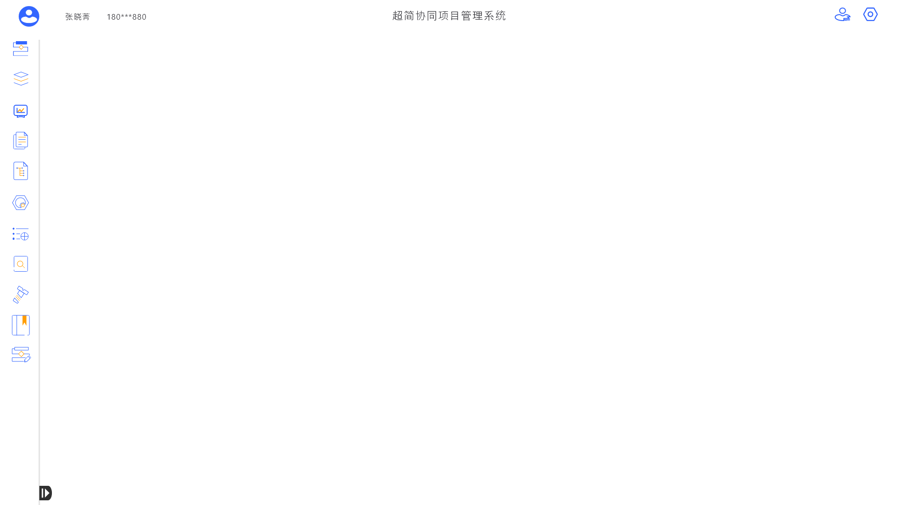
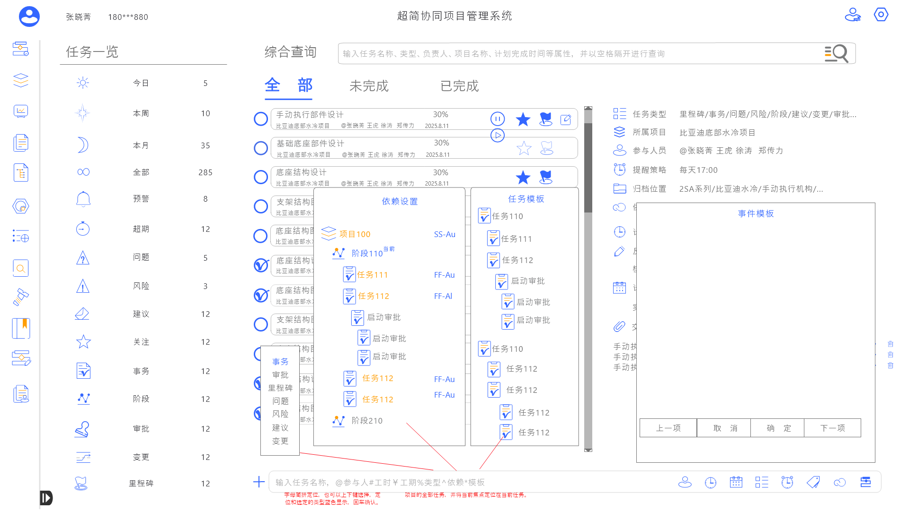
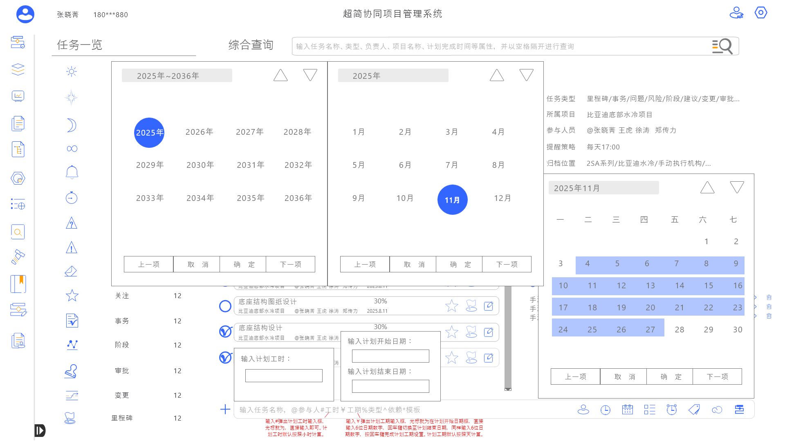
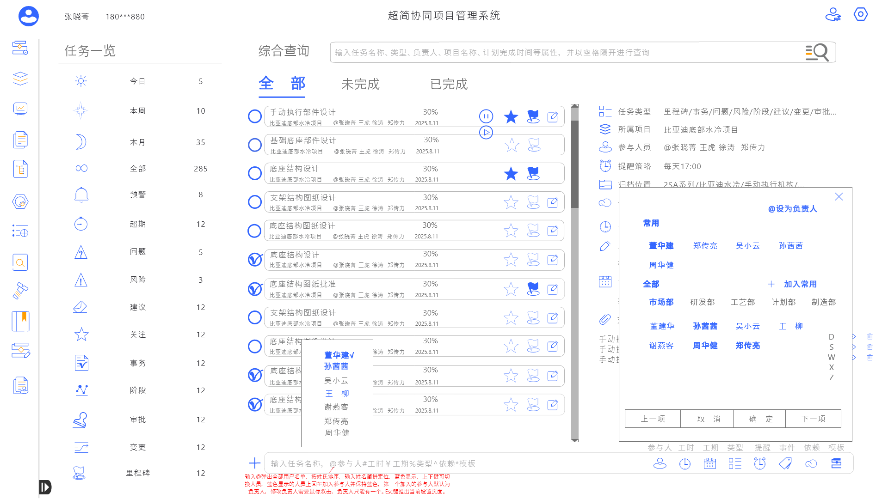
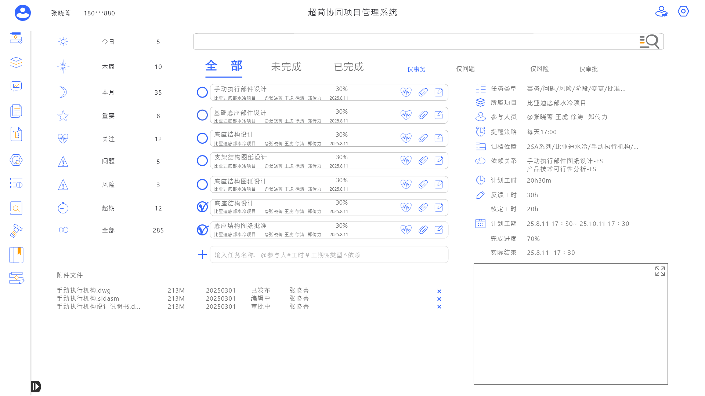
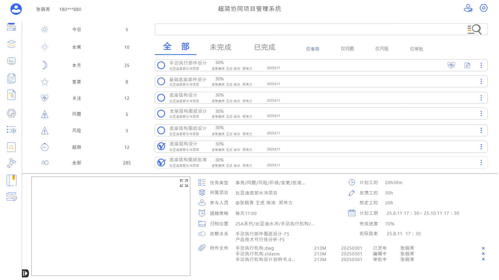
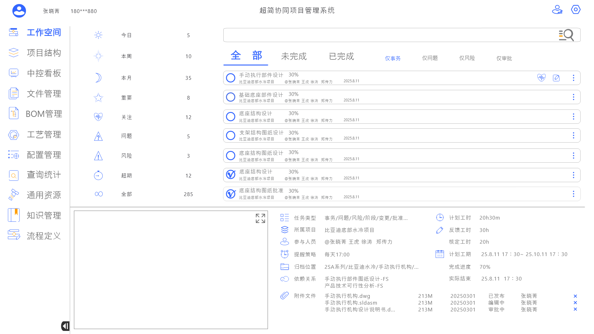
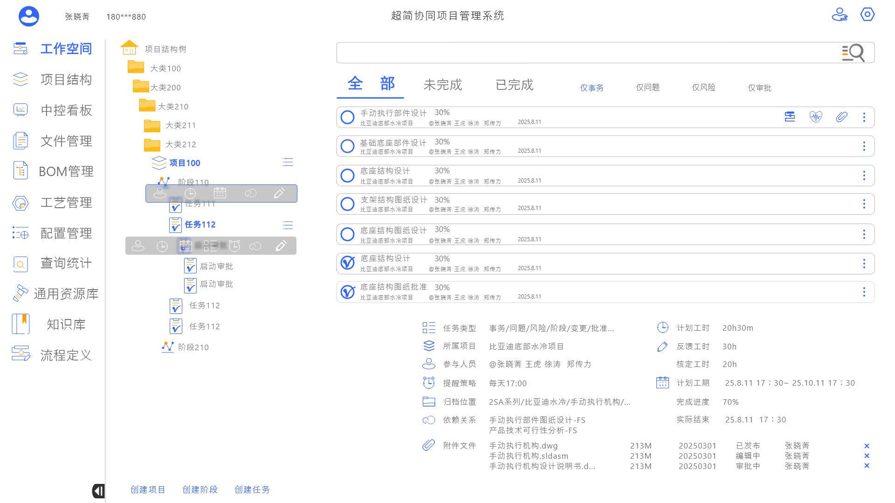

# SyncFlow 超简协同项目管理系统 -- 详细设计文档

> **文档版本**：v1.0  
> **编写日期**：2026-05-01  
> **文档状态**：初稿  
> **适用范围**：产品设计、前端开发、UI/UX 团队  
> **设计来源**：UI/UX 设计稿（`uiux/`）、图标资源（`图标/图标3/`）、设计规范 PDF（`图标资源-web.pdf`）

---

## 目录

- [第1章：产品概述](#第1章产品概述)
- [第2章：信息架构与导航设计](#第2章信息架构与导航设计)
- [第3章：设计规范与设计系统](#第3章设计规范与设计系统)
- [第4章：图标资源规范](#第4章图标资源规范)
- [第5章：中控看板（Dashboard）](#第5章中控看板dashboard)
- [第6章：项目管理（Project Management）](#第6章项目管理project-management)
- [第7章：待办事项（Todo / Workspace）](#第7章待办事项todo--workspace)
- [第8章：文件管理（File Management）](#第8章文件管理file-management)
- [第9章：配置管理（Configuration Management）](#第9章配置管理configuration-management)
- [第10章：我的任务（My Tasks）](#第10章我的任务my-tasks)
- [第11章：拓展模块设计](#第11章拓展模块设计)
- [第12章：数据模型概要](#第12章数据模型概要)
- [第13章：技术选型建议](#第13章技术选型建议)
- [第14章：补充细化设计](#第14章补充细化设计)
- [第15章：设计存疑项与待确认问题](#第15章设计存疑项与待确认问题)
- [第16章：修订建议与后续行动](#第16章修订建议与后续行动)

---

# 第1章：产品概述

## 1.1 产品名称

- **产品全称**：超简协同项目管理系统
- **产品英文名**：SyncFlow
- **产品简称**：SyncFlow

**命名释义**："Sync"代表同步协同，"Flow"代表流畅的工作流。SyncFlow 寓意团队成员之间的信息同步与任务流转如流水般顺畅高效。

## 1.2 产品定位

SyncFlow 是一款面向**工业制造领域**的协同项目管理平台，专为制造业、新能源、汽车行业（尤其是电动汽车/电池领域）的复杂工程项目管理而设计。

与通用型项目管理工具（如 Jira、Trello、飞书项目等）不同，SyncFlow 深度契合工业级项目的特殊需求：

| 维度 | 通用项目管理工具 | SyncFlow |
|------|----------------|----------|
| 项目层级 | 扁平或简单二级结构 | 多层级项目树（可嵌套至 8 层以上） |
| 项目阶段 | 自定义标签 | 预置工业标准阶段模型（调查→概念→计划→开发→测试→量产） |
| 协同对象 | 以软件开发团队为主 | 跨部门协同（设计部、产品部、研发部、测试部、管理层） |
| 专业模块 | 无 | 内置 BOM 管理、工艺管理、文件协同等工业专用模块 |
| 数据管理 | 基础统计 | 多维度查询统计、中控看板、数据驱动决策 |
| AI 能力 | 基础或无 | AI 辅助决策（进度预警、风险识别、资源优化建议） |

## 1.3 目标用户

SyncFlow 的目标用户覆盖项目全生命周期中的各角色：

| 角色 | 所属部门 | 核心诉求 | 使用频率 |
|------|---------|---------|---------|
| 项目经理 | 项目管理部 | 全局掌控项目进度、资源调配、风险管控 | 每日高频 |
| 产品工程师 | 产品部 | 需求管理、BOM 维护、产品配置 | 每日高频 |
| 设计工程师 | 设计部 | 设计任务管理、文件协同、版本追踪 | 每日高频 |
| 研发工程师 | 研发部 | 开发任务领取、工时反馈、测试进度 | 每日高频 |
| 测试工程师 | 测试部 | 测试计划管理、缺陷追踪、测试报告 | 按项目阶段 |
| 工艺工程师 | 工艺部 | 工艺流程管理、工艺文件维护 | 按项目阶段 |
| 部门主管 | 各部门 | 部门任务分配、团队负荷监控 | 每日中频 |
| 高管/管理层 | 总经办/管理层 | 项目总览、战略决策、跨项目管控 | 每周/关键节点 |

## 1.4 核心价值

SyncFlow 为工业级项目团队提供以下核心价值：

### 1.4.1 任务协同
打破部门壁垒，实现跨部门、跨团队的任务流转与协同。支持任务的创建、分配、转派、依赖关联，确保每个任务都有明确的责任人和截止时间。

### 1.4.2 进度可视化
提供多种视图（甘特图、泳道图、计划表、看板等）直观展示项目进度。中控看板一屏总览所有项目状态，管理层无需逐一查阅即可掌握全局。

### 1.4.3 多维度项目管控
支持多层级项目树结构，完整覆盖从整车到零部件（如 汽车 → 新能源 → 电池 → 电池 pack → 电池模组 → 电池包 → 电池冷却液）的细分层级。每个层级独立管控，也可汇总统计。

### 1.4.4 AI 辅助决策
- **进度预警**：AI 智能识别延期风险，提前预警
- **资源优化**：分析团队负荷，智能推荐任务分配方案
- **风险识别**：基于历史数据和当前进度，识别潜在项目风险
- **智能报表**：自动生成项目周报/月报，辅助管理层决策

## 1.5 应用场景

### 1.5.1 跨部门协同
**场景描述**：一个电池 pack 开发项目涉及设计部、研发部、测试部、工艺部、采购部等多个部门。SyncFlow 提供统一的协作平台，各部门在系统中领取任务、更新进度、提交交付物，项目经理实时掌握各部门进展。

**关键功能**：任务分配与转派、交付文件管理、进度看板、通知提醒

### 1.5.2 项目排期管理
**场景描述**：电池模组开发项目需要经历调查→概念→计划→开发→测试→量产六个阶段。每个阶段有明确的里程碑和交付物。SyncFlow 支持通过甘特图直观管理项目排期，自动计算关键路径，标识延期风险。

**关键功能**：甘特图视图、阶段管理、里程碑设置、依赖关系管理

### 1.5.3 任务分配与追踪
**场景描述**：项目经理将电池冷却液研发任务拆解为多个子任务，分配给不同工程师。每位工程师在工作空间中查看自己的待办事项，更新任务状态，反馈实际工时。项目经理通过看板追踪整体完成情况。

**关键功能**：工作空间（个人待办）、任务状态管理、工时反馈、进度追踪

### 1.5.4 文件协同管理
**场景描述**：电池 pack 项目的图纸、规格书、测试报告等文件散落在不同工程师的本地。SyncFlow 提供统一的文件管理空间，支持文件的版本管理、在线预览、权限控制，确保团队成员始终使用最新版本的文件。

**关键功能**：文件上传/下载、版本管理、在线预览、权限控制

### 1.5.5 BOM（物料清单）管理
**场景描述**：电池 pack 包含数百种零部件和原材料。SyncFlow 内置 BOM 管理模块，支持多层级 BOM 结构的创建、维护、版本管理和变更追踪。与项目任务关联，确保 BOM 变更及时同步到相关部门。

**关键功能**：BOM 树结构、版本管理、变更管理、与项目任务关联

### 1.5.6 工艺管理
**场景描述**：电池模组的制造涉及焊接、组装、测试等多道工艺。SyncFlow 工艺管理模块支持工艺流程的定义、工艺参数的维护、工艺文件的管理，与项目阶段关联，确保工艺开发与产品开发同步推进。

**关键功能**：工艺流程定义、工艺参数管理、工艺文件维护、与项目阶段联动

---

# 第2章：信息架构与导航设计

## 2.1 系统信息架构总览

SyncFlow 的信息架构采用**左侧边栏 + 顶栏 + 内容区**的经典三栏布局。系统包含 12 大功能模块，通过左侧导航栏进行切换。

```
┌─────────────────────────────────────────────────────────────────┐
│  全局顶栏（Global Header）                                       │
│  [头像] 用户名 | 团队名 | 团队人数  ...  [通知] [语言] [搜索] [设置] │
├────────┬────────────────────────────────────────────────────────┤
│        │                                                         │
│  左侧  │                    内容区                               │
│  导航  │              （各模块功能页面）                            │
│  边栏  │                                                         │
│        │                                                         │
│ [图标] │                                                         │
│ [图标] │                                                         │
│ [图标] │                                                         │
│  ...   │                                                         │
│        │                                                         │
├────────┴────────────────────────────────────────────────────────┤
│  状态栏（可选）                                                   │
└─────────────────────────────────────────────────────────────────┘
```

## 2.2 左侧导航栏设计

### 2.2.1 导航栏交互规范

| 属性 | 说明 |
|------|------|
| **默认状态** | 展开，宽度 240px，显示图标 + 文字标签 |
| **收起状态** | 宽度 64px，仅显示图标，文字隐藏 |
| **展开/收起** | 点击导航栏顶部的展开/收起按钮，配合平滑过渡动画（300ms ease-in-out） |
| **激活态** | 选中模块高亮显示，背景色 #EBF0FF，图标切换为选中态图标，文字颜色 #3366FF |
| **悬停态** | 背景色 #F5F7FA，鼠标变为 pointer |
| **滚动** | 当模块数量超出视口高度时，导航栏内容区支持纵向滚动 |

### 2.2.2 12 大功能模块导航

左侧导航栏按以下顺序排列 12 个功能模块：

| 序号 | 模块名称 | 英文名称 | 图标文件 | 说明 |
|------|---------|---------|---------|------|
| 01 | 工作空间 | Workspace | `01工作空间.svg` | 个人待办事项、日程、通知聚合 |
| 02 | 项目管理 | Project Management | `02项目管理.svg` | 多视图项目管理（甘特图/泳道图/计划表/看板） |
| 03 | 中控看板 | Central Dashboard | `03中控看板.svg` | 项目总览仪表盘，一屏掌握全局 |
| 04 | 文件管理 | File Management | `04文件管理.svg` | 项目文件协同、版本管理、在线预览 |
| 05 | BOM管理 | BOM Management | `05BOM管理.svg` | 物料清单管理、BOM 树、版本与变更 |
| 06 | 工艺管理 | Process Management | `06工艺管理.svg` | 制造工艺流程定义与管理 |
| 07 | 配置管理 | Configuration | `07配置管理.svg` | 角色权限配置、系统参数配置 |
| 08 | 查询统计 | Query & Statistics | `08查询统计.svg` | 数据查询、统计分析、报表导出 |
| 09 | 通用资源 | General Resources | `09通用资源.svg` | 共享资源库（模板、标准、规范等） |
| 10 | 知识管理 | Knowledge Management | `10知识管理.svg` | 知识沉淀、经验文档、最佳实践 |
| 11 | 模板定义 | Template Definition | `11模板定义.svg` | 项目模板、任务模板的创建与维护 |
| 12 | 个人文件夹 | Personal Folder | `12个人文件夹.svg` | 个人文档空间、私有文件存储 |

**导航图标引用规范**：

- 普通态图标路径：`图标/图标3/XX模块名.svg`
- 选中态图标路径：`图标/图标3/XX模块名-选中.svg`
- 图标尺寸：24 x 24 px
- 图标与文字间距：12px
- 文字样式：14px / Regular / #333333

导航图标预览见 [第4章 图标资源规范](#42-导航图标12-组)。

## 2.3 全局顶栏设计

### 2.3.1 顶栏布局

全局顶栏固定在页面顶部，始终可见，高度 56px，白色背景，底部 1px 边框（#E8E8E8）。

```
┌──────────────────────────────────────────────────────────────────────────┐
│ [圆形头像] 张三 >  │ 电池Pack研发团队 │ 团队人数: 12人  ▼  │    🔔  中/EN  🔍  ⚙ │
└──────────────────────────────────────────────────────────────────────────┘
│← ─── 左侧区域 ─── →│← ─── 中间区域 ── →│← ───── 右侧区域 ───── →│
```

### 2.3.2 左侧区域：用户信息与团队

| 元素 | 规格 | 说明 |
|------|------|------|
| **用户头像** | 32 x 32px 圆形，若未设置头像则显示默认头像 | 点击弹出个人设置菜单 |
| **用户名** | 14px / Medium / #333333 | 显示当前登录用户姓名 |
| **所属团队** | 14px / Regular / #666666 | 显示当前所属团队名称 |
| **团队人数** | 12px / Regular / #999999 | 格式："团队人数: N人" |
| **团队切换** | 下拉箭头图标 | 点击展开团队切换下拉列表 |

### 2.3.3 右侧区域：工具栏

| 元素 | 规格 | 说明 |
|------|------|------|
| **通知中心** | 铃铛图标，24 x 24px | 显示未读通知数量（红色圆形角标） |
| **语言切换** | 文字按钮"中/EN" | 中文与英文即时切换 |
| **全局搜索** | 搜索图标 24 x 24px | 支持搜索项目、任务、文件、BOM 等全平台内容 |
| **设置入口** | 齿轮图标，24 x 24px | 点击进入系统设置页面（仅管理员可见） |

### 2.3.4 通知中心详情

点击铃铛图标后弹出通知面板：

- **面板尺寸**：360 x 480px，右对齐顶栏
- **通知分类**：全部 / 任务通知 / 审批通知 / 系统通知
- **单条通知**：左侧彩色圆点（区分类型）+ 通知标题 + 通知摘要 + 时间
- **未读标识**：蓝色圆点，已读后消失
- **操作**：全部标为已读、进入通知中心查看完整列表

## 2.4 模块功能层级

各功能模块的信息层级如下：

### 2.4.1 工作空间（Workspace）

```
工作空间
├── 我的待办
│   ├── 今日任务
│   ├── 本周任务
│   ├── 本月任务
│   └── 全部任务
├── 我的审批
├── 我的关注
├── 日程视图
└── 通知消息
```

### 2.4.2 项目管理（Project Management）

```
项目管理
├── 项目列表（树形结构）
│   └── 汽车 → 新能源 → 电池 → 电池Pack → 电池模组 → 电池包 → 电池冷却液
├── 视图切换
│   ├── 基本视图（列表）
│   ├── 甘特图（任务甘特图 / 项目甘特图）
│   ├── 泳道图
│   ├── 计划表
│   └── 看板视图
├── 项目详情
│   ├── 项目概览
│   ├── 阶段管理（调查→概念→计划→开发→测试→量产）
│   ├── 任务管理
│   ├── 里程碑管理
│   └── 项目设置
└── 筛选与排序
```

### 2.4.3 中控看板（Central Dashboard）

```
中控看板
├── 项目总览卡片
├── 进度概览（按阶段/按状态）
├── 预警与风险面板
├── 资源负荷热力图
└── 关键指标 KPI
```

### 2.4.4 其他模块

| 模块 | 子层级 |
|------|--------|
| 文件管理 | 文件列表 → 文件夹结构 → 文件详情（版本历史、预览、权限） |
| BOM管理 | BOM 树 → BOM 项 → BOM 版本 → BOM 变更记录 |
| 工艺管理 | 工艺列表 → 工艺流程 → 工艺参数 → 工艺文件 |
| 配置管理 | 角色管理 → 权限配置 → 系统参数 → 组织架构 |
| 查询统计 | 预设报表 → 自定义查询 → 数据导出 → 图表分析 |
| 通用资源 | 资源分类 → 资源列表 → 资源详情 → 下载/引用 |
| 知识管理 | 知识分类 → 文章列表 → 文章详情 → 搜索 |
| 模板定义 | 项目模板 → 任务模板 → 模板编辑 → 模板应用 |
| 个人文件夹 | 我的文件 → 文件夹管理 → 上传/下载 |

---

# 第3章：设计规范与设计系统

## 3.1 色彩系统

### 3.1.1 主色（Primary）

| 色彩角色 | 色值 | RGB | 使用场景 |
|---------|------|-----|---------|
| **主色（Primary）** | `#3366FF` | rgb(51, 102, 255) | 主要按钮、链接文字、激活态图标、选中态导航、进度条填充 |

主色梯度：

| 级别 | 色值 | 使用场景 |
|------|------|---------|
| Primary-1（最浅） | `#EBF0FF` | 选中态背景、标签背景 |
| Primary-2 | `#C2D4FF` | 悬停态背景 |
| Primary-3 | `#8AA8FF` | 边框、分割线 |
| Primary-4 | `#5B85FF` | 按钮悬停态 |
| Primary-5（标准） | `#3366FF` | 主按钮、链接、图标选中态 |
| Primary-6（最深） | `#1A3FCC` | 按钮按下态 |

### 3.1.2 辅助色（Secondary）

| 色彩角色 | 色值 | RGB | 使用场景 |
|---------|------|-----|---------|
| **辅助色（Secondary）** | `#FF9C00` | rgb(255, 156, 0) | 进度指示、强调标记、重要提示、预警标识 |

### 3.1.3 语义色（Semantic Colors）

| 色彩角色 | 色值 | RGB | 使用场景 |
|---------|------|-----|---------|
| **紧急/高优先级** | `#FF4D4F` | rgb(255, 77, 79) | 紧急任务标签、高优先级标识、错误状态 |
| **进行中/中优先级** | `#FAAD14` | rgb(250, 173, 20) | 进行中状态、中优先级标识、警告状态 |
| **已完成/低优先级** | `#52C41A` | rgb(82, 196, 26) | 已完成状态、低优先级标识、成功状态 |
| **待分配/未开始** | `#8C8C8C` | rgb(140, 140, 140) | 待分配状态、未开始状态、禁用态 |
| **已延期** | `#A0522D` | rgb(160, 82, 45) | 延期任务标识、超期警告 |
| **已取消** | `#BFBFBF` | rgb(191, 191, 191) | 已取消状态、失效标识 |

### 3.1.4 中性色（Neutral Colors）

| 色彩角色 | 色值 | 使用场景 |
|---------|------|---------|
| **标题文字** | `#1A1A1A` | 页面标题、卡片标题 |
| **正文文字** | `#333333` | 正文内容、导航文字 |
| **次要文字** | `#666666` | 说明文字、辅助信息 |
| **占位符文字** | `#999999` | 输入框占位文字、时间戳 |
| **禁用文字** | `#BFBFBF` | 禁用状态文字 |
| **分割线** | `#E8E8E8` | 边框、分割线、表格线 |
| **页面背景** | `#F5F7FA` | 页面底色、内容区背景 |
| **卡片背景** | `#FFFFFF` | 卡片、面板、模态框背景 |
| **悬停背景** | `#F5F5F5` | 表格行悬停、列表项悬停 |

## 3.2 状态定义

### 3.2.1 任务状态

| 状态 | 中文名称 | 语义色 | 色值 | 标签样式 | 触发条件 |
|------|---------|-------|------|---------|---------|
| `NOT_STARTED` | 未开始 | 灰色 | `#8C8C8C` | 灰色文字 + 灰色边框 | 任务已创建，尚未启动 |
| `IN_PROGRESS` | 进行中 | 黄色/橙色 | `#FAAD14` | 深色文字 + 黄色背景 | 任务已被领取并正在执行 |
| `ON_HOLD` | 暂停 | 棕色 | `#A0522D` | 深色文字 + 棕色背景 | 任务因外部原因暂停 |
| `COMPLETED` | 已完成 | 绿色 | `#52C41A` | 深色文字 + 绿色背景 | 任务已完成并通过验收 |
| `OVERDUE` | 已延期 | 红色 | `#FF4D4F` | 白色文字 + 红色背景 | 任务超过截止日期未完成 |
| `CANCELLED` | 已取消 | 浅灰 | `#BFBFBF` | 灰色文字 + 浅灰背景 | 任务被取消，不再执行 |
| `PENDING_ASSIGN` | 待分配 | 灰色 | `#8C8C8C` | 灰色文字 + 灰色边框 | 任务已创建，等待分配责任人 |
| `URGENT` | 紧急 | 红色 | `#FF4D4F` | 白色文字 + 红色背景 | 标记为紧急，需立即处理 |

**状态流转规则**：

```
待分配 → 未开始 → 进行中 → 已完成
                  ↓
                暂停 → 进行中
                  ↓
                已取消
         未开始/进行中 → 已延期 → 进行中 → 已完成
         任意状态 → 紧急（优先级提升，不改变流转方向）
```

### 3.2.2 任务优先级

| 优先级 | 英文标识 | 标签颜色 | 标签样式 | 说明 |
|--------|---------|---------|---------|------|
| 高 | `HIGH` | 红色 `#FF4D4F` | 红色背景 + 白色文字 | 关键路径任务、阻塞性任务 |
| 中 | `MEDIUM` | 黄色 `#FAAD14` | 黄色背景 + 深色文字 | 常规任务 |
| 低 | `LOW` | 绿色 `#52C41A` | 绿色背景 + 深色文字 | 非紧急任务、优化类任务 |
| 紧急 | `URGENT` | 红色 `#FF4D4F` | 红色背景 + 白色文字 + 闪烁动画 | 紧急任务，需立即响应 |

### 3.2.3 项目阶段状态

| 阶段 | 英文标识 | 语义色 | 说明 |
|------|---------|-------|------|
| 调查 | `INVESTIGATION` | `#8C8C8C` | 需求调研与可行性分析 |
| 概念 | `CONCEPT` | `#3366FF` | 概念设计与方案确定 |
| 计划 | `PLANNING` | `#FAAD14` | 详细计划制定与资源分配 |
| 开发 | `DEVELOPMENT` | `#FF9C00` | 产品开发与实现 |
| 测试 | `TESTING` | `#3366FF` | 测试验证与问题修复 |
| 量产 | `MASS_PRODUCTION` | `#52C41A` | 批量生产准备与上线 |

## 3.3 字体规范

| 层级 | 字号 | 字重 | 行高 | 颜色 | 使用场景 |
|------|------|------|------|------|---------|
| H1 一级标题 | 28px | Semibold (600) | 36px | `#1A1A1A` | 页面主标题 |
| H2 二级标题 | 22px | Semibold (600) | 30px | `#1A1A1A` | 模块标题 |
| H3 三级标题 | 16px | Medium (500) | 24px | `#333333` | 卡片标题、区域标题 |
| Body 正文 | 14px | Regular (400) | 22px | `#333333` | 正文内容、表格数据 |
| Caption 辅助文字 | 12px | Regular (400) | 20px | `#999999` | 提示文字、时间戳、角标 |

**字体族**：
- 中文：PingFang SC / Microsoft YaHei / SimHei
- 英文/数字：Helvetica Neue / Arial / sans-serif
- 等宽（代码/编号）：SF Mono / Monaco / Consolas

## 3.4 组件规范

### 3.4.1 卡片（Card）

| 属性 | 规格 |
|------|------|
| 背景色 | `#FFFFFF`（白色） |
| 圆角 | `8px` |
| 阴影 | `0 2px 8px rgba(0, 0, 0, 0.08)` |
| 内边距 | `16px`（四边均等） |
| 边框 | 无边框（依赖阴影区分层级） |
| 悬停态 | 阴影加深为 `0 4px 16px rgba(0, 0, 0, 0.12)`，过渡 200ms |

### 3.4.2 表格（Table）

| 属性 | 规格 |
|------|------|
| 表头背景色 | `#FAFAFA` |
| 表头文字 | 14px / Medium (500) / `#333333` |
| 行高 | `48px` |
| 斑马纹 | 奇数行白色 `#FFFFFF`，偶数行 `#FAFAFA` |
| 悬停行 | 背景色 `#F0F5FF` |
| 边框 | 底部边框 `1px solid #E8E8E8` |
| 单元格内边距 | 水平 `16px`，垂直 `12px` |

### 3.4.3 标签/徽章（Badge）

| 属性 | 规格 |
|------|------|
| 形状 | 圆角胶囊型（border-radius: 100px） |
| 内边距 | 水平 `8px`，垂直 `2px` |
| 字号 | 12px / Regular |
| 最小宽度 | `48px`（居中对齐） |

### 3.4.4 进度条（Progress Bar）

| 属性 | 规格 |
|------|------|
| 轨道高度 | `8px` |
| 轨道颜色 | `#F0F0F0` |
| 轨道圆角 | `4px` |
| 填充颜色 | `#3366FF`（主色），可按状态变色 |
| 百分比文字 | 进度条右侧，14px / Regular / `#333333` |
| 动画 | 填充过渡 500ms ease-out |

**进度条变体**：

| 变体 | 填充色 | 使用场景 |
|------|--------|---------|
| 默认 | `#3366FF` | 通用进度展示 |
| 成功 | `#52C41A` | 已完成（100%） |
| 警告 | `#FAAD14` | 进度滞后 |
| 危险 | `#FF4D4F` | 严重滞后或延期 |

### 3.4.5 分页（Pagination）

**显示格式**：`共 X 条 | 1 / Y 页 | < 1  2  3  ...  Y >`

| 属性 | 规格 |
|------|------|
| 整体字号 | 14px / Regular / `#333333` |
| 分隔符 | 竖线 `|`，颜色 `#E8E8E8` |
| 页码按钮 | 32 x 32px，圆角 4px |
| 当前页码 | 背景 `#3366FF`，文字白色 |
| 每页条数选择 | 默认 20 条/页，可选 10/20/50/100 |

### 3.4.6 按钮（Button）

| 按钮类型 | 背景色 | 文字色 | 边框 | 使用场景 |
|---------|--------|--------|------|---------|
| **主要按钮** | `#3366FF` | `#FFFFFF` | 无 | 新建、提交、确认 |
| **次要按钮** | `#FFFFFF` | `#333333` | `1px solid #D9D9D9` | 取消、返回、重置 |
| **文字按钮** | 透明 | `#3366FF` | 无 | 查看详情、更多 |
| **危险按钮** | `#FF4D4F` | `#FFFFFF` | 无 | 删除、作废 |
| **成功按钮** | `#52C41A` | `#FFFFFF` | 无 | 成功/确认操作 |

**按钮尺寸**：

| 尺寸 | 高度 | 内边距（水平） | 字号 | 圆角 |
|------|------|-------------|------|------|
| 大（Large） | 40px | 24px | 16px | 4px |
| 中（Medium，默认） | 32px | 16px | 14px | 4px |
| 小（Small） | 24px | 12px | 12px | 4px |

### 3.4.7 搜索栏（Search）

| 属性 | 规格 |
|------|------|
| 高度 | 36px |
| 圆角 | 18px（全圆角） |
| 背景色 | `#F5F7FA` |
| 边框 | `1px solid #E8E8E8`，聚焦时变为 `1px solid #3366FF` |
| 左侧图标 | 放大镜图标，16 x 16px，颜色 `#999999` |
| 占位文字 | 14px / Regular / `#999999` |

### 3.4.8 其他组件

**输入框（Input）**：高 36px，圆角 4px，边框 `#D9D9D9`，聚焦 `#3366FF`，错误态 `#FF4D4F`。

**选择器（Select）**：外观同输入框 + 下拉箭头，下拉面板白色背景 + 阴影，选中项 `#EBF0FF` 背景。

**模态框（Modal）**：遮罩层 `rgba(0,0,0,0.45)`，容器 8px 圆角，阴影 `0 8px 24px rgba(0,0,0,0.16)`。

**通知提示（Message）**：信息 `#3366FF`、成功 `#52C41A`、警告 `#FAAD14`、错误 `#FF4D4F`。

## 3.5 间距系统

采用 4px 基础单位的间距体系：

| 代号 | 数值 | 使用场景 |
|------|------|---------|
| `xs` | 4px | 紧凑元素间距、图标与文字间距 |
| `sm` | 8px | 相关元素间距、卡片内元素间距 |
| `md` | 12px | 组件内元素间距 |
| `lg` | 16px | 卡片内边距、常规区块间距 |
| `xl` | 24px | 区域间间距、模态框内边距 |
| `xxl` | 32px | 大区块间距 |
| `xxxl` | 48px | 页面级区块间距 |

## 3.6 圆角规范

| 级别 | 数值 | 使用场景 |
|------|------|---------|
| 无圆角 | 0 | 全屏面板 |
| 小圆角 | 4px | 按钮、输入框、标签 |
| 中圆角 | 8px | 卡片、模态框、弹出面板 |
| 大圆角 | 12px | 特殊卡片、引导框 |
| 全圆角 | 100px | 胶囊型标签、搜索栏 |

## 3.7 阴影规范

| 层级 | 阴影值 | 使用场景 |
|------|--------|---------|
| 层级 1（基础） | `0 2px 8px rgba(0, 0, 0, 0.08)` | 卡片、静态元素 |
| 层级 2（悬停） | `0 4px 16px rgba(0, 0, 0, 0.12)` | 卡片悬停、下拉菜单 |
| 层级 3（浮层） | `0 8px 24px rgba(0, 0, 0, 0.16)` | 模态框、弹出层 |
| 层级 4（顶层） | `0 12px 32px rgba(0, 0, 0, 0.20)` | 工具提示、全局通知 |

---

# 第4章：图标资源规范

## 4.1 图标总览

SyncFlow 图标资源采用 SVG 矢量格式，基于 Adobe XD 自定义设计。

**图标设计原则**：

| 原则 | 说明 |
|------|------|
| **一致性** | 所有图标采用相同的线宽（2px）、圆角风格、视觉重量 |
| **简洁性** | 避免过度细节，在 24px 尺寸下清晰可辨 |
| **语义性** | 图标含义直观，降低用户学习成本 |
| **双态设计** | 每个导航图标均有普通态和选中态，选中态使用主色 `#3366FF` |

**图标技术规格**：

| 属性 | 规格 |
|------|------|
| 格式 | SVG |
| 画布尺寸 | 24 x 24 px |
| 安全区域 | 20 x 20 px |
| 描边宽度 | 2px |
| 线帽/线连接 | Round |
| 设计工具 | Adobe XD |
| 文件目录 | `图标/图标3/` |

## 4.2 导航图标（12 组）

| 序号 | 模块 | 普通态预览 | 选中态预览 |
|------|------|-----------|-----------|
| 01 | 工作空间 |  |  |
| 02 | 项目管理 |  |  |
| 03 | 中控看板 |  |  |
| 04 | 文件管理 |  |  |
| 05 | BOM管理 |  |  |
| 06 | 工艺管理 |  |  |
| 07 | 配置管理 |  |  |
| 08 | 查询统计 |  |  |
| 09 | 通用资源 |  |  |
| 10 | 知识管理 |  |  |
| 11 | 模板定义 |  |  |
| 12 | 个人文件夹 |  |  |

## 4.3 一览图标（15 个）

一览图标用于中控看板和工作空间中的快速筛选标签：

| 序号 | 图标名称 | 文件名 | 用途说明 |
|------|---------|--------|---------|
| 01 | 今日 | `一览1-今日.svg` | 筛选今日到期/今日创建的任务 |
| 02 | 本周 | `一览2-本周.svg` | 筛选本周内的任务 |
| 03 | 本月 | `一览3-本月.svg` | 筛选本月内的任务 |
| 04 | 全部 | `一览4-全部.svg` | 显示全部任务/项目 |
| 05 | 预警 | `一览5-预警.svg` | 显示有预警信息的项目/任务 |
| 06 | 超期 | `一览6-超期.svg` | 显示已超期的任务 |
| 07 | 问题 | `一览7-问题.svg` | 显示标记为有问题的项目/任务 |
| 08 | 风险 | `一览8-风险.svg` | 显示存在风险的项目/任务 |
| 09 | 建议 | `一览9-建议.svg` | 显示系统 AI 建议 |
| 10 | 关注 | `一览-10关注.svg` | 显示被关注的项目/任务 |
| 11 | 事务 | `一览-11事务.svg` | 显示待处理事务 |
| 12 | 阶段 | `一览-12阶段.svg` | 按项目阶段维度查看 |
| 13 | 审批 | `一览-13审批.svg` | 显示待审批事项 |
| 14 | 变更 | `一览-14变更.svg` | 显示变更请求/记录 |
| 15 | 里程碑 | `一览-15里程碑.svg` | 显示里程碑节点 |

## 4.4 基本/表单图标

### 表单字段图标

| 序号 | 图标名称 | 文件名 | 使用场景 |
|------|---------|--------|---------|
| 01 | 任务类型 | `基本1-任务类型.svg` | 任务表单中的"任务类型"字段标识 |
| 02 | 所属项目 | `基本2-所属项目.svg` | 任务表单中的"所属项目"字段标识 |
| 03 | 参与人 | `基本3- 参与人.svg` | 任务表单中的"参与人/责任人"字段标识 |
| 04 | 提醒策略 | `基本4- 提醒策略.svg` | 任务表单中的"提醒策略"字段标识 |
| 05 | 归档位置 | `基本5-归档位置.svg` | 任务表单中的"归档位置"字段标识 |
| 06 | 依赖关系 | `基本6-依赖关系.svg` | 任务表单中的"前置/后置依赖"字段标识 |
| 07 | 计划工时 | `基本7- 计划工时.svg` | 任务表单中的"计划工时"字段标识 |
| 08 | 反馈工时 | `基本8-反馈工时.svg` | 任务表单中的"实际/反馈工时"字段标识 |
| 09 | 计划工期 | `基本9 计划工期.svg` | 任务表单中的"计划工期"字段标识 |
| 10 | 交付文件 | `基本10交付文件.svg` | 任务表单中的"交付文件"字段标识 |

### 操作图标

| 序号 | 图标名称 | 文件名 | 使用场景 |
|------|---------|--------|---------|
| 01 | 新建任务 | `基本-11 新建任务-加号.svg` | 新建任务按钮图标 |
| 02 | 任务模板 | `基本 -12任务模板.svg` | 任务模板选择/应用 |
| 03 | 事件 | `基本 -13事件.svg` | 事件/日程创建与管理 |

### 交付文件操作图标

| 序号 | 图标名称 | 文件名 | 使用场景 |
|------|---------|--------|---------|
| 01 | 编辑 | `基本-10-1交付文件编辑.svg` | 编辑已上传的交付文件信息 |
| 02 | 浏览 | `基本-10-2交付文件浏览.svg` | 在线预览交付文件 |
| 03 | 删除 | `基本-10-3交付文件删除.svg` | 删除交付文件（需二次确认） |

## 4.5 任务状态图标

| 序号 | 图标名称 | 文件名 | 使用场景 |
|------|---------|--------|---------|
| 01 | 未完成 | `全部 1- 未完成.svg` | 标识任务为未完成状态（空心圆） |
| 02 | 已完成 | `全部 2 - 已完成.svg` | 标识任务为已完成状态（实心勾选圆） |
| 03 | 暂停任务 | `全部 3- 暂停任务.svg` | 暂停当前任务 |
| 04 | 已关注 | `全部 4- 已关注.svg` | 标识任务已被关注 |
| 05 | 未关注 | `全部 4- 未关注.svg` | 标识任务未被关注 |
| 06 | 编辑任务 | `全部 5- 编辑任务.svg` | 编辑任务详情入口 |
| 07 | 里程碑 | `全部 6- 里程碑.svg` | 标识任务为里程碑节点 |
| 08 | 设为里程碑 | `全部 6-设为里程碑.svg` | 将普通任务标记为里程碑 |

## 4.6 泳道图图标

| 序号 | 图标名称 | 文件名 | 说明 |
|------|---------|--------|------|
| 01 | 未开始里程碑 | `泳道图-未开始里程碑.svg` | 尚未到达的里程碑节点（灰色） |
| 02 | 进行中里程碑 | `泳道图-进行中里程碑 .svg` | 当前阶段的里程碑节点（蓝色，带脉冲动画） |
| 03 | 已完成里程碑 | `泳道图-已完成里程碑 - 副本.svg` | 已完成的里程碑节点（绿色） |
| 04 | 进行中任务 | `泳道图-进行中任务.svg` | 正在执行的任务条块 |

## 4.7 项目结构树图标

| 序号 | 图标名称 | 文件名 | 说明 |
|------|---------|--------|------|
| 01 | 根节点 | `项目结构树1 - 根节点.svg` | 项目树的最顶层根节点 |
| 02 | 项目 | `项目结构树 -项目.svg` | 项目级节点 |
| 03 | 阶段 | `项目结构树 -阶段.svg` | 项目阶段节点 |
| 04 | 任务 | `项目结构树 - 任务.svg` | 任务节点（叶子节点） |
| 05 | 项目大类 | `项目结构树-项目大类.svg` | 项目分类节点 |

## 4.8 独立/工具图标

| 序号 | 图标名称 | 文件名 | 使用场景 |
|------|---------|--------|---------|
| 01 | 设置 | `设置.svg` | 全局顶栏设置入口 |
| 02 | 切换用户 | `切换用户.svg` | 多账号切换 |
| 03 | 默认头像 | `默认头像.svg` | 用户未设置头像时的占位头像 |
| 04 | 综合查询 | `综合查询.svg` | 全局搜索入口 |
| 05 | 导航-展开 | `导航- 展开.svg` | 左侧导航栏展开按钮 |
| 06 | 导航-收起 | `导航- 收起.svg` | 左侧导航栏收起按钮 |

## 4.9 SVG 引入方式

**方式一：直接引用（推荐）**

```html

```

**方式二：SVG Sprite**

```html
<svg class="icon" width="24" height="24">
  <use xlink:href="icons.svg#workspace" />
</svg>
```

**方式三：组件化引入（推荐用于 React/Vue）**

```jsx
import { ReactComponent as WorkspaceIcon } from '图标/图标3/01工作空间.svg';
import { ReactComponent as WorkspaceActiveIcon } from '图标/图标3/01工作空间-选中.svg';

<WorkspaceIcon className={`nav-icon ${isActive ? 'active' : ''}`} />
```

---

# 第5章：中控看板（Dashboard）

> 设计参考：

## 5.1 功能概述

中控看板是 SyncFlow 系统的**项目管理中枢**，面向项目经理及团队负责人：

| 核心价值 | 说明 |
|---------|------|
| 全局项目总览 | 以甘特图形式一览所有项目排期，快速识别延期风险 |
| 本周聚焦 | 聚合本周关键任务，按工作日排列 |
| 灵活视图切换 | 支持「排期视图」与「看板视图」两种模式 |
| 多维度筛选 | 按公司管理、进度管理维度筛选 |

## 5.2 项目排期视图

> 设计参考：

### 5.2.1 页面整体布局

项目排期视图采用**左内容+右面板**布局，内容区上下分区：

```
┌────────────────────────────────────────┬──────────────┐
│  顶部导航栏（用户信息 + 日期/完成率）    │              │
├────────────────────────────────────────┤  右侧信息面板  │
│  操作工具栏（新增/导入/配置 + 筛选下拉）  │  （5.3 节）   │
├────────────────────────────────────────┤              │
│  项目排期甘特区（主区域，占约 60% 高度）  │              │
├────────────────────────────────────────┤              │
│  本周任务区（占约 25% 高度）             │              │
└────────────────────────────────────────┴──────────────┘
```

### 5.2.2 顶部导航栏

**左侧用户信息区：**

| 元素 | 说明 |
|------|------|
| 用户头像 | 圆形头像，带橙色星标装饰 |
| 用户名称 | 当前登录用户姓名（如"邓智豪"） |
| 所属团队 | 当前团队名称（如"设计团队"） |
| 团队人数 | 当前团队成员数量（如"30人"） |
| 团队切换下拉 | 支持切换所属团队，切换后看板数据联动刷新 |

**右侧状态指示区：**

| 元素 | 说明 |
|------|------|
| 日期范围选择器 | 显示"计划开始时间 计划结束时间"，带日历图标，可选择日期范围筛选 |
| 完成率指示器 | 显示"已完成 100%"，分段式水平进度条（橙/黄/绿），每段上限 100% |

### 5.2.3 操作工具栏

**操作按钮组（左侧）：**

| 按钮 | 功能说明 |
|------|---------|
| 新增 | 创建新项目，弹出项目创建表单 |
| 导入 | 支持从文件导入项目数据（Excel/CSV） |
| 配置 | 打开看板配置面板 |

**筛选下拉组（右侧）：**

| 筛选项 | 说明 |
|--------|------|
| 公司管理 | 按公司/组织维度筛选项目 |
| 进度管理 | 按进度状态筛选（全部/进行中/已延期/未开始） |

### 5.2.4 甘特排期区

**时间轴（列头）：**

| 属性 | 说明 |
|------|------|
| 时间跨度 | 跨年度，覆盖 2025-2026 年 |
| 粒度 | 月粒度 |
| 标签格式 | 年份行 + 月份行 |
| 滚动/缩放 | 支持横向滚动和时间轴缩放 |

**项目行（每行一个项目）：**

| 元素 | 说明 |
|------|------|
| 状态标签 | 位于行首，标签样式区分项目状态 |
| 彩色横条 | 表示项目起止时间，颜色与状态关联 |
| 悬停提示 | 鼠标悬停显示项目详情 |

**项目状态标签定义：**

| 状态 | 标签样式 | 颜色 | 说明 |
|------|---------|------|------|
| 进行中 | 实底标签 | 橙色 | 项目正在执行中 |
| 已延期 | 实底标签 | 红色 | 项目已超过计划截止时间 |
| 未开始 | 实底标签 | 灰色 | 项目尚未启动 |

## 5.3 右侧信息面板

> 设计参考：``（右侧面板区域）

右侧面板位于中控看板排期视图的右侧，提供预警监控、待办统计和超期提醒等关键信息，帮助项目经理快速识别需要关注的问题。

### 5.3.1 面板整体布局

```
┌────────────────────────────────┐
│  ▾ 选择项目                     │
├────────────────────────────────┤
│  预警(1)    风险(2)    建议(3)  │
├────────────────────────────────┤
│  待办事项详情 Todo               │
│  今日待办  Today     2          │
│  超期      Overdue   3          │
│  待分配    Pending   1          │
├────────────────────────────────┤
│  超期提醒                       │
│  • 上海新能源电池pack外观设计     │
│    超期3天                      │
│  • 确认新项目需求评审文档         │
│    超期1天                      │
│  • 首页样式修改                  │
│    超期7天                      │
└────────────────────────────────┘
```

### 5.3.2 项目选择器

| 元素 | 说明 |
|------|------|
| 选择项目 | 下拉选择器，可切换当前查看的项目，切换后面板数据联动刷新 |

### 5.3.3 预警/风险/建议计数

| 指标 | 示例值 | 说明 |
|------|--------|------|
| 预警 | 1 | 有预警信息的项目/任务数量 |
| 风险 | 2 | 存在风险的项目/任务数量 |
| 建议 | 3 | AI 建议或优化建议数量 |

点击任意指标可跳转至对应的预警/风险/建议详情列表。

### 5.3.4 待办事项详情 Todo

| 指标 | 英文 | 示例值 | 说明 |
|------|------|--------|------|
| 今日待办 | Today | 2 | 今日需处理的任务数 |
| 超期 | Overdue | 3 | 已超过截止日期的任务数 |
| 待分配 | Pending | 1 | 等待分配的任务数 |

点击任意指标可联动筛选当前项目的待办任务列表。

### 5.3.5 超期提醒列表

超期提醒区域以列表形式展示当前项目中已超期的任务，每条记录包含任务名称和超期天数：

| 任务名称 | 超期天数 | 说明 |
|----------|---------|------|
| 上海新能源电池pack外观设计 | 3 天 | 已超过计划截止日期 |
| 确认新项目需求评审文档 | 1 天 | 已超过计划截止日期 |
| 首页样式修改 | 7 天 | 已超过计划截止日期 |

点击任意超期任务可跳转至该任务详情页。

## 5.4 本周任务区

> 设计参考：（底部区域)

本周任务区采用**水平卡片排列**布局，按工作日从左到右排列（周一至周五）。

**任务卡片元素：**

| 元素 | 说明 |
|------|------|
| 日期标题 | 日期 + 星期（如 "5/19 周一"） |
| 任务标题 | 任务名称，单行显示，溢出省略 |
| 优先级色条 | 卡片左侧竖条，颜色编码优先级（红/黄/绿） |
| 进度标签 | 显示当前任务进度状态 |
| 截止日期 | 任务截止时间 |

## 5.5 看板视图（Kanban）

> 设计参考：

看板视图将任务按工作流阶段组织为列式看板。

### 5.5.1 顶部日期筛选栏

> 设计参考：（顶部栏区域）

| 元素 | 说明 |
|------|------|
| 日期范围选择器 | 格式 "YYYY/MM/DD - YYYY/MM/DD"，默认当月范围（如"2026/05/01 - 2026/05/31"），可自定义选择 |
| 完成率指示器 | 显示"已完成 100%"，与排期视图共享同一指标，分段式水平进度条（橙/黄/绿） |

### 5.5.2 看板列定义

| 列名 | 英文标识 | 说明 | 卡片示例数 |
|------|---------|------|-----------|
| 待办 | To do | 待启动的任务 | 2 tasks |
| 进行中 | In Progress | 正在执行的任务 | 1 task |
| 已完成 | Done | 已完成的任务 | 3 tasks |
| 待审核 | Pending | 等待审核确认 | 0 tasks |
| 已批准 | Approved | 审核通过 | 2 tasks |
| 已拒绝 | Rejected | 被驳回 | 1 task |

### 5.5.3 任务卡片设计

| 元素 | 位置 | 说明 |
|------|------|------|
| 日期标签 | 卡片顶部 | 任务日期 |
| 任务标题 | 卡片主体 | 任务名称 |
| 优先级标签 | 标题下方 | 彩色圆角标签（高红/中黄/低绿） |
| 负责人头像 | 卡片底部 | 圆形头像 |
| 左侧色条 | 卡片左边缘 | 竖条颜色标识优先级 |

### 5.5.4 交互行为

| 交互 | 响应行为 |
|------|---------|
| 卡片拖拽至目标列 | 任务状态变更，触发状态更新 |
| 点击列头"+"按钮 | 弹出快速创建表单 |
| 点击 ALL PROJECTS | 切换显示范围 |
| 点击任务卡片 | 打开任务详情侧边弹窗 |
| 使用 Sort/Filter | 即时过滤看板卡片 |

## 5.6 交互设计

### 视图切换

排期视图 ↔ 看板视图通过顶部切换按钮操作，切换时保持当前筛选条件不变。

### 数据筛选联动

| 筛选维度 | 影响范围 |
|---------|---------|
| 公司管理 | 甘特图项目行和看板任务卡片 |
| 进度管理 | 甘特图项目行和看板任务卡片 |
| 团队切换 | 全局数据刷新 |

---

# 第6章：项目管理（Project Management）

> 设计参考：

## 6.1 功能概述

项目管理是 SyncFlow 的**核心功能模块**，提供多维度视图的项目排期与任务管理能力。

| 能力维度 | 说明 |
|---------|------|
| 项目树导航 | 多级项目层级结构，快速定位项目节点 |
| 多视图切换 | 计划表、任务甘特图、项目甘特图三种核心视图 |
| 排期管理 | 以甘特图为核心，支持拖拽调整排期 |
| 进度追踪 | 实时展示任务进度百分比与状态 |
| 批量编辑 | 计划表视图支持批量编辑排期数据 |

## 6.2 项目树结构

> 设计参考：（左侧面板)

### 6.2.1 项目树层级

项目树位于页面左侧，最多支持 **7 级层级**：

| 层级 | 示例 | 说明 |
|------|------|------|
| L1 - 行业大类 | 汽车 | 一级分类 |
| L2 - 领域 | 新能源 | 二级分类 |
| L3 - 产品线 | 电池 | 产品线 |
| L4 - 子系统 | 电池pack | 子系统 |
| L5 - 模组 | 电池模组 | 模组级 |
| L6 - 组件 | 电池包 | 组件级 |
| L7 - 零件 | 电池冷却液 | 最细粒度节点 |

### 6.2.2 项目阶段定义

项目阶段定义遵循第3章 3.2.3 节统一规范，包含 6 个固定阶段：**调查 → 概念 → 计划 → 开发 → 测试 → 量产**。

### 6.2.3 项目树性能约束

| 约束项 | 限制值 | 说明 |
|--------|--------|------|
| 最大嵌套层级 | 7 级 | 超出时提示"已达到最大层级" |
| 单节点最大子节点数 | 500 | 超出时使用分页加载 |
| 首次加载节点数 | 3 级 | 默认展开至第3级，更深层级按需加载 |
| 搜索范围 | 全层级 | 搜索时递归遍历所有层级 |

### 6.2.4 项目树交互

| 交互 | 响应行为 |
|------|---------|
| 展开/收起节点 | 展开/折叠子节点列表 |
| 选中节点 | 高亮选中，右侧内容区联动展示数据 |
| 右键菜单 | 新增子项目/编辑/删除/复制 |
| 搜索 | 实时过滤树节点，匹配项高亮 |

## 6.3 基本信息视图

> 设计参考：

### 6.3.1 Tab 导航栏

| Tab 名称 | 说明 |
|---------|------|
| 计划表 | 切换至计划表视图 |
| 任务甘特图 | 切换至任务甘特图视图 |
| 项目甘特图 | 切换至项目甘特图视图 |

### 6.3.2 项目详情卡片

**元数据字段定义：**

| 字段名 | 字段类型 | 说明 |
|--------|---------|------|
| 任务名称 | 文本 | 任务标题 |
| 已完成 | 标签 | 任务状态标签（绿色标签表示已完成） |
| 所属部门 | 文本 | 任务所属部门（如"设计部"） |
| 设计内容 | 文本 | 任务描述 / 设计内容说明 |
| 任务属性 | 标签 | 任务分类标签（如"总结"等） |
| 优先级 | 标签 | 高（红）/ 中（黄）/ 低（绿） |
| 截止时间 | 日期 | 任务截止日期（MM/DD 格式） |
| 任务状态 | 标签 | 进行中/已完成/待开始等 |

### 6.3.3 任务列表

**任务列表列定义：**

| 列名 | 列宽 | 说明 |
|------|------|------|
| 设计内容 | 自适应 | 任务描述 |
| 任务属性 | 100px | 分类标签 |
| 优先级 | 80px | 优先级标签，颜色编码 |
| 截止时间 | 120px | 日期格式：MM/DD |
| 任务状态 | 100px | 状态标签，颜色编码 |

## 6.4 计划表视图

> 设计参考：

计划表视图以**表格式甘特图**形式呈现排期数据，适合批量编辑。

### 时间轴设计（双层表头）

| 层级 | 内容 | 示例 |
|------|------|------|
| 第一层 | 月份 | 1月、2月 ... 7月 |
| 第二层 | 周次 | W1、W2 ... W13 |

### 行结构设计

| 行类型 | 说明 | 样式 |
|--------|------|------|
| 表头行 | 分组标题行（部门/职能） | 加粗背景色，可展开/收起 |
| 任务行 | 具体任务排期行 | 白色背景，含甘特条 |
| 汇总行 | 汇总时间段覆盖范围 | 底部灰色背景 |

**每行数据：** 任务名称 + 进度百分比（60%~85%）+ 时间跨度条

## 6.5 任务甘特图

> 设计参考：

任务甘特图以**泳道式甘特图**展示任务时间分布。

### 页面布局

```
┌───────────────────────┬──────────────────────────────────────────────┐
│  筛选面板（左侧）       │  甘特图主体（右侧）                           │
│                       │  1月  2月  3月  4月  5月  6月  7月           │
│  (展开) 全部 (4)       │  W1 W2 W3 W4 W5 ... W13                    │
│  (展开) 设计部 (0)     │  ████████  ██████  ████████                  │
│  (展开) 生产部 (1)     │  ██████████████                              │
│                       │  ████  ████████  ██████                     │
└───────────────────────┴──────────────────────────────────────────────┘
```

**左侧筛选面板**：树形结构组织部门和组别，支持选择性显示。勾选部门后右侧甘特图仅显示该部门任务。

| 筛选项 | 数量标记 | 说明 |
|--------|---------|------|
| 全部 | (4) | 显示所有部门的任务，共 4 个筛选项 |
| 设计部 | (0) | 设计部相关任务（当前无数据） |
| 生产部 | (1) | 生产部相关任务（当前 1 条） |

**甘特条颜色编码：**

| 颜色 | 含义 | 说明 |
|------|------|------|
| 蓝色 | 进行中任务 | 正在执行的常规任务 |
| 黄色 | 待审核/计划中 | 等待确认或规划阶段 |
| 绿色 | 已完成任务 | 已完成或即将完成 |
| 红色 | 紧急/延期任务 | 高优先级或已延期 |
| 青色 | 辅助/协调任务 | 支持性或跨部门协调 |

**甘特条交互：** 拖拽两端调整起止时间、拖拽中间平移、悬停显示详情气泡、双击打开编辑弹窗。

## 6.6 项目甘特图

> 设计参考：

项目甘特图以**项目级别**时间线视图呈现，粒度更粗，关注项目整体进度。

### 左侧部门树

- 顶部"全部收起"链接
- 展开/收起控制
- 部门节点可展开包含子任务

### 甘特条标注格式

```
任务名称  MM/DD-MM/DD
```

例如："任务1  01/01-01/30"

### 底部汇总条

汇总所有任务的时间覆盖范围，浅色背景条。

## 6.7 泳道图/看板

> 设计参考：

### 看板模式（Kanban Mode）

**看板列定义（按阶段）：**

| 列 | 阶段 | 说明 |
|----|------|------|
| 列1 | 调查 | 调查阶段的任务 |
| 列2 | 概念 | 概念阶段的任务 |
| 列3 | 计划 | 计划阶段的任务 |
| 列4 | 开发 | 开发阶段的任务 |

**任务卡片元素：** 任务名称 + 优先级标签（高/中/低）+ 状态标签 + 里程碑标记（菱形图标）+ 负责人头像

## 6.8 交互设计

### Tab 切换

切换视图时保持当前选中的项目树节点不变，内容区淡入淡出过渡（200ms），记忆每个 Tab 的滚动位置和缩放级别。

### 项目树联动

选中项目节点 → 右侧加载数据；父节点选中 → 展示子项目汇总数据；叶子节点选中 → 展示详细任务数据。

### 任务详情弹窗

以**侧边弹窗**从右侧滑入，包含：任务名称 + 状态标签、基本信息（所属项目/负责人/优先级/截止日期）、描述区、进度区、子任务区、评论区、操作按钮（编辑/删除/指派/状态变更）。

---

# 第7章：待办事项（Todo / Workspace）

> 设计参考：

## 7.1 功能概述

待办事项模块是 SyncFlow 的**个人工作空间**，为每位用户集中展示其负责的所有待办任务，并集成 AI 智能助手提供任务分析与行动建议。

| 核心能力 | 说明 |
|---------|------|
| 任务聚合 | 汇聚用户在所有项目中被分配的任务 |
| 状态管理 | 一站式查看和管理任务状态 |
| 智能筛选 | 按时间、状态、关键词多维筛选 |
| AI 助手 | 集成 AI 分析面板，提供任务统计与智能建议 |

## 7.2 任务列表

> 设计参考：

### 7.2.1 页面布局

AI 面板收起时任务列表占据全宽：

```
┌──────────────────────────────────────────────────────────┐
│  待办事项  [AI助手按钮]  [搜索图标]                        │
├──────────────────────────────────────────────────────────┤
│  [全部任务 ▾]  [日期范围]  [全部状态 ▾]                    │
├──────────────────────────────────────────────────────────┤
│  任务行 1  任务名称  状态标签  优先级  负责人  截止日期  进度 │
│  任务行 2  ...                                           │
│  ...                                                     │
└──────────────────────────────────────────────────────────┘
```

### 7.2.2 任务行字段定义

| 字段名 | 列宽 | 说明 |
|--------|------|------|
| 任务名称 | 自适应 | 任务标题文本 |
| 状态标签 | 100px | 任务当前状态，圆角标签 |
| 优先级标签 | 80px | 任务优先级，圆角标签 |
| 负责人 | 100px | 负责人姓名 |
| 截止日期 | 100px | MM/DD 格式 |
| 进度条 | 150px | 可视化进度条 + 百分比数字 |

**状态标签定义**（遵循第3章设计系统统一色值）：

| 状态 | 背景色 | 文字色 | 说明 |
|------|--------|--------|------|
| 紧急 | #FFF1F0 | #FF4D4F | 需立即处理的紧急任务 |
| 进行中 | #FFF7E6 | #FAAD14 | 正在执行中的任务 |
| 已完成 | #F6FFED | #52C41A | 已完成的任务 |
| 待开始 | #F5F5F5 | #8C8C8C | 尚未启动的任务 |
| 待分配 | #F5F5F5 | #8C8C8C | 未指派负责人的任务 |
| 已延期 | #FFF1F0 | #A0522D | 超过截止日期的任务 |

> **注**：所有状态色值统一源自第3章 3.1.3 语义色定义，全文档一致。

**优先级标签定义**：

| 优先级 | 背景色 | 文字色 |
|--------|--------|--------|
| 高 | #FFF1F0 | #FF4D4F |
| 中 | #FFF7E6 | #FAAD14 |
| 低 | #F6FFED | #52C41A |

## 7.3 筛选与搜索

### 7.3.1 筛选条件定义

筛选栏以**图标+文字+数量**的形式横向排列，使用第4章定义的一览图标。设计稿中可见的筛选项：

| 序号 | 筛选项 | 图标 | 数量 | 说明 |
|------|--------|------|------|------|
| 1 | 今日 | 今日 | 2 | 今日需处理的任务 |
| 2 | 本周 | 本周 | 5 | 本周内的任务 |
| 3 | 本月 | 本月 | 8 | 本月内的任务 |
| 4 | 全部 | 全部 | 10 | 全部任务 |
| 5 | 预警 | 预警 | 1 | 有预警的任务 |
| 6 | 超期 | 超期 | 3 | 超过截止日期的任务 |
| 7 | 问题 | 问题 | 2 | 标记为有问题的任务 |
| 8 | 风险 | 风险 | 1 | 存在风险的任务 |
| 9 | 建议 | 建议 | 4 | 有优化建议的任务 |
| 10 | 关注 | 关注 | 2 | 被关注的任务 |
| 11 | 事务 | 事务 | 3 | 待处理事务 |
| 12 | 阶段 | 阶段 | 2 | 阶段相关任务 |
| 13 | 审批 | 审批 | 1 | 待审批任务 |
| 14 | 变更 | 变更 | 1 | 变更相关任务 |
| 15 | 里程碑 | 里程碑 | 1 | 里程碑节点任务 |

每个筛选项点击后即时过滤任务列表，选中态图标变为主色 `#3366FF` 并显示底部蓝色指示条。

此外保留：
- **日期范围选择器**：双日期选择器，预设选项（最近7天/30天/本季度/自定义）
- **状态下拉**：全部状态 / 紧急 / 进行中 / 已完成 / 待开始 / 待分配 / 已延期

### 7.3.2 筛选行为

| 规则 | 说明 |
|------|------|
| 即时生效 | 任何筛选条件变更后，列表即时刷新 |
| 多条件组合 | 时间筛选、状态筛选、搜索关键词为 AND 关系 |
| URL 同步 | 筛选条件同步至 URL 参数 |
| 实时搜索 | 输入过程中即时过滤（300ms 防抖） |

## 7.4 AI 助手面板

> 设计参考：

### 7.4.1 面板状态

| 状态 | 说明 | 设计参考 |
|------|------|---------|
| 收起 | AI 面板隐藏，任务列表全宽 | `Todo.png` |
| 展开（标准） | AI 面板以标准宽度展开 | `Todo – 2.png` |
| 展开（宽） | 面板以更宽尺寸展开，显示详细建议 | `Todo – 1.png` / `Todo – 3.png` |

### 7.4.2 面板布局

```
┌────────────────────────────────────────┐
│  AI 助手  [项目选择器 ▾]                │
├────────────────────────────────────────┤
│  AI 摘要区域                            │
│  "AI 分析了您在"默认项目"中的 10 个任务,  │
│   当前完成率为 50%。"                    │
│                                         │
│  10 Total Tasks  50% Completion Rate    │
├─────────────────┬──────────────────────┤
│  未开始  1      │  进行中  2            │
├─────────────────┼──────────────────────┤
│  已完成  5      │  已延期  1            │
├─────────────────┼──────────────────────┤
│  未完成  -      │  紧急  1              │
├─────────────────┴──────────────────────┤
│  建议文本区                             │
│  "建议优先处理即将到期的紧急任务,        │
│   并跟进已延期任务的进度。"              │
└────────────────────────────────────────┘
```

**指标卡定义：**

| 指标卡 | 数值 | 说明 |
|--------|------|------|
| 未开始 | 1 | 尚未启动的任务数（对应任务状态"待开始/待分配"） |
| 进行中 | 2 | 正在执行的任务数 |
| 已完成 | 5 | 已完成的任务数 |
| 已延期 | 1 | 超过截止日期的任务数 |

**补充说明：**
- "10 Total Tasks 50% Completion Rate" 为 AI 摘要区域的英文辅助说明，展示总任务数和完成率
- "未完成" 为 AI 面板中的独立标签，用于标识任务整体完成情况，不属于四个指标卡之一
- "紧急" 为独立于四级分类（未开始/进行中/已完成/已延期）的状态标签

### 7.4.3 AI 数据计算规则

| 指标 | 计算公式 |
|------|---------|
| 总任务数 | 当前项目下该用户负责的所有任务数 |
| 完成率 | 已完成任务数 / 总任务数 * 100% |
| 未开始数 | 状态 = "待开始" 或 "待分配" |
| 进行中数 | 状态 = "进行中" |
| 已完成数 | 状态 = "已完成" |
| 已延期数 | 状态 = "已延期" |

> **注**：指标卡中的"未开始"对应第3章任务状态中的"待开始（NOT_STARTED）"和"待分配（PENDING_ASSIGN）"两种状态，即尚未进入执行阶段的任务均计入"未开始"指标。

## 7.5 交互设计

### AI 面板交互

| 交互 | 响应行为 |
|------|---------|
| 展开/收起 | 面板滑入/滑出，任务列表宽度自适应 |
| 项目切换 | AI 分析数据即时刷新 |
| 指标卡片点击 | 任务列表筛选为该状态 |
| 建议刷新 | 任务数据变更后自动更新 |

### 任务行交互

| 交互 | 响应行为 |
|------|---------|
| 查看详情 | 打开任务详情弹窗/页面 |
| 状态快速切换 | 弹出状态选择下拉，即时更新 |
| 进度更新 | 弹出进度输入框，可拖拽或输入百分比 |
| 悬停高亮 | 行背景色变浅蓝，显示操作图标 |

---

# 第8章：文件管理（File Management）

> 设计参考：

## 8.1 功能概述

文件管理模块是项目文件集中存储、版本管理和协同共享中心。

**核心价值：**
- **集中存储**：项目相关文件统一存储，避免信息孤岛
- **版本管理**：支持多版本管理，完整追溯变更历史
- **协同共享**：团队成员按权限访问、下载和上传文件
- **空间管控**：存储空间统计，合理规划资源

## 8.2 文件列表视图

### 8.2.1 页面头部

| 区域 | 元素 | 说明 |
|------|------|------|
| 标题区 | "项目文件" | 页面主标题 |
| 操作区 | "上传文件"按钮 | 蓝色主按钮 |
| 搜索区 | 搜索栏 | 占位文本"搜索文件名..." |

### 8.2.2 统计信息栏

```
共 126 个文件  1.3/20.0GB  可用 18.7GB
```

| 指标 | 示例值 | 说明 |
|------|--------|------|
| 文件总数 | 126 | 当前项目下的文件和文件夹总数 |
| 已用空间 | 1.3 GB | 已使用的存储空间 |
| 总容量 | 20.0 GB | 项目总存储配额 |
| 可用空间 | 18.7 GB | 剩余可用存储空间 |

### 8.2.3 类型筛选Tab

| Tab标签 | 筛选逻辑 |
|---------|----------|
| 全部 | 显示所有类型文件 |
| 文档 | .docx/.doc/.md/.txt/.pdf |
| 图片 | .png/.jpg/.jpeg/.gif/.svg |
| 代码 | .js/.ts/.py/.java/.go |

### 8.2.4 文件列表表格

| 列名 | 字段 | 说明 |
|------|------|------|
| 文件图标 | icon | 区分文件夹/文档/图片/表格/代码 |
| 文件名 | name | 文件或文件夹名称 |
| 大小 | size | 自动适配单位（KB/MB/GB） |
| 上传时间 | upload_time | YYYY-MM-DD HH:mm |
| 上传者 | uploader | 上传者姓名 |

### 8.2.5 分页控件

```
共 126 条 | 1 / 13 | < 1 2 3 ... 13 >
```

默认每页10条，支持切换（10/20/50/100）。

## 8.3 文件操作

### 上传文件

- **按钮上传**：点击"上传文件"按钮
- **拖拽上传**：将文件拖拽至列表区域
- **批量上传**：支持多文件同时上传
- 单文件大小限制：默认最大 200MB
- 同名文件提示覆盖或重命名
- 支持断点续传

### 下载/删除/重命名

- 单文件下载、批量下载（打包 zip）、文件夹下载
- 删除需二次确认，进入回收站保留 30 天
- 重命名不允许特殊字符，同级目录不重名

### 版本管理

| 功能 | 说明 |
|------|------|
| 版本查看 | 历史版本列表（版本号、时间、上传者） |
| 版本下载 | 下载指定历史版本 |
| 版本回滚 | 回滚至指定版本 |
| 版本对比 | 文档类文件支持内容 diff |

版本号自增（v1, v2, v3...），默认保留最近 20 个版本。

### 分享与权限

| 权限级别 | 说明 |
|----------|------|
| 仅查看 | 可预览和下载 |
| 可编辑 | 可上传新版本、重命名、移动 |
| 管理 | 可删除、设置权限、管理版本 |

## 8.4 交互设计

- Tab 切换即时生效，筛选条件与搜索可叠加
- 面包屑导航：`项目文件 > 项目资料 > 技术文档`
- 多选操作：复选框 + 批量操作栏（下载/删除/移动）
- 右键菜单：打开、下载、分享、重命名、移动到、版本历史、删除

---

# 第9章：配置管理（Configuration Management）

## 9.1 功能概述

配置管理模块负责组织架构、角色权限和系统通知的统一管理。

**核心价值：** 组织建模、权限管控（RBAC）、成员管理、通知配置

## 9.2 角色权限配置

> 设计参考：

### 9.2.1 双面板布局

| 面板 | 位置 | 内容 |
|------|------|------|
| 左面板 | 角色权限配置 | 部门选择器 + 角色列表 + 操作入口 |
| 右面板 | 角色成员 | 选中角色的成员列表 + 成员管理 |

### 9.2.2 部门体系

| 部门 | 角色数量 | 说明 |
|------|----------|------|
| 公司管理层 | 3 | 高管及决策层角色 |
| 设计部 | 4 | 设计相关角色 |
| 产品部 | 3 | 产品相关角色 |
| 研发部 | 3 | 研发相关角色 |
| 测试部 | 2 | 测试相关角色 |

**各部门角色-成员详细关系：**

**公司管理层（3 roles）：**

| 角色 | 成员 |
|------|------|
| 管理层 - 总经理 | 张伟 |
| 管理层 - 副总经理 | 李娜、刘强 |
| 管理层 - 财务总监 | 王芳 |

**设计部（4 roles）：**

| 角色 | 成员 |
|------|------|
| 管理层 - 设计主管 | 邓智豪 |
| 设计师 | 王美玲、陈思远、李小龙、赵雨薇 |

**产品部（3 roles）：**

| 角色 | 成员 |
|------|------|
| 管理层 - 产品经理 | 王晓明 |
| 需求分析师 | 王晓明、赵静怡、钱俊杰 |
| 产品助理 | 刘婷婷、杨帆 |

**研发部（3 roles）：**

| 角色 | 成员 |
|------|------|
| 管理层 - 研发主管 | 刘伟 |
| 前端工程师 | 陈晨、赵磊、黄晓东 |
| 后端工程师 | 周鑫、吴杰、孙涛 |

**测试部（2 roles）：**

| 角色 | 成员 |
|------|------|
| 测试主管 | 孙小雨 |
| 测试工程师 | 孙小雨、周鑫、吴文杰 |

### 9.2.3 角色成员

成员列表示例（设计部 - 设计主管）：

| 成员 | 角色 |
|------|------|
| 邓智豪 | 设计主管 |
| 王美玲 | 设计师 |
| 陈思远 | 设计师 |
| 李小龙 | 设计师 |
| 赵雨薇 | 设计师 |

操作：编辑角色信息、删除角色、移除成员（单个X + 批量）、添加成员。

## 9.3 角色配置（卡片视图）

> 设计参考：

部门Tab栏切换，角色卡片2列网格布局：

| 序号 | 卡片标题 | 成员 |
|------|----------|------|
| 1 | 管理层 - 设计主管 | 邓智豪、设计师：王美玲等3人 |
| 2 | 设计师 | 王美玲、陈思远、李小龙、赵雨薇 |
| 3 | 管理层 - 产品经理 | 王晓明 |
| 4 | 需求分析师 | 王晓明、赵静怡、钱俊杰 |
| 5 | 测试主管 | 孙小雨 |
| 6 | 测试工程师 | 孙小雨、周鑫、吴文杰 |

## 9.4 成员管理

> 设计参考：

**添加成员流程：** 点击"添加成员" → 弹出选择弹窗（搜索 + 人员列表）→ 多选 → 确认添加

**移除成员：** 单个移除（行右侧X按钮）、批量移除（勾选后"移除成员"按钮），需二次确认。

## 9.5 通知与提醒设置

> 设计参考：

| 配置项 | 说明 |
|--------|------|
| 任务提醒开关 | 总开关，滑动开关，开启态蓝色高亮 |
| 通知方式 | 邮件通知（默认勾选）、应用内通知（默认勾选）、短信通知（默认未勾选） |
| 提醒时间 | 提前1天 / 提前3天（默认选中）/ 提前7天 |
| 操作按钮 | 保存设置（蓝色）+ 重置（灰色边框） |

---

# 第10章：我的任务（My Tasks）

## 10.1 功能概述

我的任务模块为用户提供个人任务的统一视图，聚焦于当前用户负责和参与的所有任务。与待办事项不同，更侧重任务全生命周期管理。

## 10.2 项目总览仪表盘

> 设计参考：

### 10.2.1 指标卡片

| 指标 | 值 | 颜色 | 说明 |
|------|-----|------|------|
| 总任务数 | 156 | 蓝色 | 所有任务总数 |
| 已完成 | 89 | 绿色 | 已完成数量 |
| 进行中 | 45 | 橙色 | 正在进行数量 |
| 待处理 | 22 | 黄色 | 尚未开始数量 |

### 10.2.2 财务卡片

| 指标 | 值 | 说明 |
|------|-----|------|
| 预计总收入 | ¥1,250,000 | 当前用户负责项目的预计总收入（人民币） |
| 实际支出 | ¥456,000 | 当前用户负责项目的实际支出（人民币） |

### 10.2.3 项目总览表格

| 列名 | 说明 |
|------|------|
| 项目名称 | 可点击进入详情 |
| 负责人 | 项目负责人 |
| 团队成员 | 成员数量（如"8人"） |
| 状态 | 进行中(橙)/已完成(绿)/待开始(灰) — 遵循第3章语义色 |
| 完成度 | 进度条+数字 |
| 开始/截止时间 | YYYY-MM-DD |
| 操作 | 查看/编辑/删除 |

分页：`共 48 条 | 1 / 5`

## 10.3 任务列表

> 设计参考：

### 10.3.1 筛选区

| 筛选项 | 类型 | 选项 |
|--------|------|------|
| 状态筛选 | 下拉 | 全部状态、紧急、进行中、已完成、待处理、已延期 |
| 优先级筛选 | 下拉 | 全部优先级、紧急、高、中、低 |
| 关键词搜索 | 搜索栏 | 按任务名称模糊搜索 |

### 10.3.2 任务表格

| 列名 | 说明 |
|------|------|
| 任务名称 | 可点击进入详情 |
| 项目 | 所属项目名称 |
| 优先级 | 紧急(红)/高(橙)/中(黄)/低(绿) |
| 状态 | 进行中(橙)/已完成(绿)/待处理(灰)/已延期(红) — 遵循第3章语义色 |
| 截止时间 | YYYY-MM-DD |
| 操作 | 查看/编辑/删除 |

分页：`共 86 条 | 1 / 9`

## 10.4 任务提醒设置

> 设计参考：

与第9章通知设置相同，但作用域为当前用户的个人配置。个人提醒设置优先级高于全局通知设置。

---

# 第11章：拓展模块设计

> 以下模块在导航图标中存在但尚无独立设计稿。基于已有模块的设计语言进行合理拓展设计。

## 11.1 BOM管理（物料清单管理）


### 功能定位

BOM（Bill of Materials）管理模块负责产品物料清单的创建、编辑、版本管理和对比分析。

### 核心功能

**BOM结构树：** 多层级父子件关系、展开/折叠、拖拽排序、右键上下文菜单

**BOM编辑：**

| 操作 | 说明 |
|------|------|
| 新增物料 | 在指定层级添加新物料节点 |
| 删除/编辑 | 移除或修改物料属性 |
| 移动/替换 | 拖拽调整层级，替换为另一物料 |

**BOM版本管理：** 版本创建、版本对比（新增/删除/修改的物料）、历史回溯、版本发布锁定

**物料信息卡片：**

| 字段 | 说明 |
|------|------|
| 物料编号 | 唯一标识符 |
| 物料名称 | 物料名称 |
| 规格型号 | 规格参数描述 |
| 供应商 | 供应商名称 |
| 单位/单价/用量 | 计量信息 |

### 布局设计

左侧面板（30%）BOM结构树 + 右侧面板（70%）物料详情表。顶部工具栏：新建/导入/导出/版本管理/BOM对比。

---

## 11.2 工艺管理（Process Management）


### 功能定位

制造工艺流程的定义、优化和管理。

### 核心功能

**工艺路线定义：** 工序列表、串行/并行关系、可视化工艺路线图、子工艺

**工艺参数管理：**

| 参数类型 | 示例 |
|----------|------|
| 温度 | 焊接温度、烘烤温度 |
| 压力 | 热压压力、注塑压力 |
| 时间 | 焊接时间、固化时间 |
| 速度 | 传送速度、转速 |

每个参数支持：目标值、上下限、单位、检测方式。

**工艺版本控制：** 多版本管理、版本对比、审批流程（草稿→评审→批准→发布）

**工艺文件管理：** SOP、工艺卡、检验标准、控制计划

### 布局设计

左侧面板（40%）工艺路线图 + 右侧面板（60%）工序详情。

---

## 11.3 查询统计（Query & Statistics）


### 功能定位

跨项目、跨部门的数据查询、统计分析和报表生成。

### 核心功能

**多维度查询：** 按项目/部门/人员/时间/状态/优先级

**统计图表：**

| 图表类型 | 说明 |
|----------|------|
| 任务完成率 | 柱状图/折线图趋势 |
| 工时分布 | 饼图/环形图 |
| 延期率 | 柱状图 |
| 里程碑达成率 | 仪表盘 |
| 资源负荷 | 堆叠柱状图 |
| 项目进度 | 甘特图对比 |

**数据导出：** Excel(.xlsx) / PDF / CSV

**预设看板：** 部门绩效、项目健康度、个人效率、团队协作

### 布局设计

三段式：顶部筛选条件区 + 中部图表展示区（2列自适应）+ 底部明细数据区。

---

## 11.4 通用资源（General Resources）


### 功能定位

跨项目共享资源的统一管理：人力资源、设备资源、外部供应商。

### 核心功能

**人力资源池：** 人员信息、技能标签、可用性、资源借用（审批流程）、技能检索

**设备资源管理：** 设备信息、使用预约、维护记录、设备状态（可用/使用中/维护中/报废）

**外部供应商管理：** 供应商信息、资质管理、合作记录、综合评级

### 布局设计

Tab切换：人力资源 / 设备资源 / 供应商 / 借用记录。每类资源提供搜索、筛选和操作工具栏。

---

## 11.5 知识管理（Knowledge Management）


### 功能定位

项目经验、技术文档和最佳实践的知识沉淀与共享。

### 核心功能

**知识库分类：** 技术文档、经验总结、FAQ、培训资料、行业资讯（树形结构）

**文章管理：** 富文本编辑器、文章状态（草稿→审核→发布→归档）、版本管理

**标签系统：** 自定义标签、标签聚合、热门标签云

**全文搜索：** 按标题/正文/标签搜索，结果高亮，按相关度排序

**评论与讨论：** @提及、一级嵌套回复、评论通知推送

### 布局设计

左侧面板（25%）分类树 + 标签云 → 右侧面板（75%）文章列表/详情。顶部：新建/搜索/视图切换/排序。

---

## 11.6 模板定义（Template Definition）


### 功能定位

项目模板和任务模板的创建与管理。

### 核心功能

**项目模板：** 预定义阶段、里程碑、任务WBS、默认角色、文档模板、工作流

**任务模板：** 预定义字段（类型/优先级/工时）、流程定义、默认参与人、检查清单、关联文档

**模板分类管理：** 按项目类型/行业场景/自定义标签

**模板导入/导出：** JSON（完整结构）/ Excel（简化格式）

**模板应用：** 创建项目时从模板创建、模板预览、自定义修改

### 布局设计

卡片网格（3列）+ 弹窗编辑。模板卡片显示：名称、分类、描述、使用次数。

---

## 11.7 个人文件夹（Personal Folder）


### 功能定位

个人私人文档空间，区别于项目级文件管理。

### 核心功能

**个人文件管理：** 上传、文件夹创建、下载/删除/重命名/移动、在线预览

**个人笔记/草稿：** 快速笔记（富文本）、草稿管理、笔记分类、笔记搜索

**项目文件收藏：** 在项目文件中收藏至个人文件夹（引用关系，不占额外空间，随源文件更新）

**存储空间管理：** 已用/可用空间、空间配额、大文件识别、重复文件检测

### 布局设计

参考文件管理模块，增加Tab切换：全部文件 / 我的笔记 / 收藏文件 / 草稿箱。侧边栏文件夹树形导航。

---

# 第12章：数据模型概要

## 12.1 核心实体

### 用户（User）

| 字段 | 类型 | 必填 | 说明 |
|------|------|------|------|
| id | UUID | 是 | 主键 |
| name | String | 是 | 姓名 |
| avatar | String | 否 | 头像URL |
| email | String | 是 | 邮箱（唯一约束） |
| phone | String | 否 | 手机号 |
| department_id | UUID | 是 | 所属部门（外键） |
| role_ids | UUID[] | 否 | 角色列表（多对多） |
| team_ids | UUID[] | 否 | 所属团队（多对多） |
| status | Enum | 是 | active/inactive/locked |
| created_at | Timestamp | 是 | 创建时间 |
| updated_at | Timestamp | 是 | 更新时间 |

### 团队（Team）

| 字段 | 类型 | 必填 | 说明 |
|------|------|------|------|
| id | UUID | 是 | 主键 |
| name | String | 是 | 团队名称 |
| description | String | 否 | 团队描述 |
| member_count | Integer | 是 | 成员数（冗余字段） |
| leader_id | UUID | 是 | 团队负责人（外键） |
| created_at | Timestamp | 是 | 创建时间 |
| updated_at | Timestamp | 是 | 更新时间 |

### 项目（Project）

| 字段 | 类型 | 必填 | 说明 |
|------|------|------|------|
| id | UUID | 是 | 主键 |
| name | String | 是 | 项目名称 |
| description | String | 否 | 项目描述 |
| parent_id | UUID | 否 | 父项目ID（树形结构） |
| category | String | 是 | 项目大类 |
| phase | Enum | 是 | survey/concept/plan/develop/test/mass_production |
| status | Enum | 是 | not_started/in_progress/completed/delayed |
| leader_id | UUID | 是 | 负责人（外键） |
| start_date | Date | 是 | 计划开始日期 |
| end_date | Date | 是 | 计划结束日期 |
| actual_start_date | Date | 否 | 实际开始日期 |
| actual_end_date | Date | 否 | 实际结束日期 |
| completion | Integer | 是 | 完成度百分比（0-100） |
| budget | Decimal | 否 | 项目预算 |
| created_at | Timestamp | 是 | 创建时间 |
| updated_at | Timestamp | 是 | 更新时间 |

### 任务（Task）

| 字段 | 类型 | 必填 | 说明 |
|------|------|------|------|
| id | UUID | 是 | 主键 |
| name | String | 是 | 任务名称 |
| description | String | 否 | 任务描述 |
| project_id | UUID | 是 | 所属项目（外键） |
| type | String | 否 | 任务类型 |
| priority | Enum | 是 | urgent/high/medium/low |
| status | Enum | 是 | todo/in_progress/completed/delayed/cancelled |
| assignee_id | UUID | 是 | 负责人（外键） |
| participant_ids | UUID[] | 否 | 参与人列表 |
| plan_start | Date | 否 | 计划开始日期 |
| plan_end | Date | 否 | 计划结束日期 |
| actual_start | Date | 否 | 实际开始日期 |
| actual_end | Date | 否 | 实际结束日期 |
| planned_hours | Float | 否 | 计划工时（小时） |
| logged_hours | Float | 否 | 已记录工时（小时） |
| progress | Integer | 是 | 进度百分比（0-100） |
| milestone | Boolean | 是 | 是否里程碑（默认 false） |
| dependencies | UUID[] | 否 | 依赖任务ID列表 |
| reminder_strategy | String | 否 | 提醒策略JSON |
| archive_location | String | 否 | 归档位置 |
| tags | String[] | 否 | 标签列表 |
| created_at | Timestamp | 是 | 创建时间 |
| updated_at | Timestamp | 是 | 更新时间 |

### 部门（Department）

| 字段 | 类型 | 必填 | 说明 |
|------|------|------|------|
| id | UUID | 是 | 主键 |
| name | String | 是 | 部门名称 |
| parent_id | UUID | 否 | 上级部门（树形结构） |
| sort_order | Integer | 否 | 排序序号 |

### 角色（Role）

| 字段 | 类型 | 必填 | 说明 |
|------|------|------|------|
| id | UUID | 是 | 主键 |
| name | String | 是 | 角色名称 |
| department_id | UUID | 是 | 所属部门（外键） |
| description | String | 否 | 角色描述 |
| permissions | String[] | 是 | 权限标识符数组 |
| member_count | Integer | 是 | 成员数量（冗余字段） |

### 文件（File）

| 字段 | 类型 | 必填 | 说明 |
|------|------|------|------|
| id | UUID | 是 | 主键 |
| name | String | 是 | 文件名 |
| type | String | 是 | folder/document/image/code/spreadsheet |
| extension | String | 否 | 文件扩展名 |
| size | Long | 是 | 文件大小（字节） |
| path | String | 是 | 存储路径 |
| parent_folder_id | UUID | 否 | 所属文件夹ID |
| uploader_id | UUID | 是 | 上传者（外键） |
| version | Integer | 是 | 版本号（默认1） |
| project_id | UUID | 否 | 关联项目（外键，NULL=个人文件） |
| download_count | Integer | 是 | 下载次数（默认0） |
| is_deleted | Boolean | 是 | 软删除标记（默认false） |

## 12.2 实体关系

```
User ──┬── M:N ── Role ── N:1 ── Department ──┬── 自关联（树形）
       ├── M:N ── Team                         │
       ├── 1:N ── Project（负责人）             │
       ├── 1:N ── Task（负责人）                │
       └── 1:N ── File（上传者）                │
                                                │
Project ──┬── 自关联（树形父子关系）             │
          ├── 1:N ── Task                       │
          └── 1:N ── File                       │
                                                │
Task ──┬── N:N ── Task（依赖关系）              │
       └── M:N ── User（参与人）                │
                                                │
File ── 自关联（树形文件夹结构）                 │
```

## 12.3 枚举值定义

### 项目阶段（ProjectPhase）

| 枚举值 | 中文 | 说明 |
|--------|------|------|
| survey | 调查 | 项目立项前的调研 |
| concept | 概念 | 概念设计 |
| plan | 计划 | 项目计划制定 |
| develop | 开发 | 开发执行 |
| test | 测试 | 测试验证 |
| mass_production | 量产 | 批量生产 |

### 任务优先级（TaskPriority）

| 枚举值 | 中文 | 颜色 | 排序权重 |
|--------|------|------|----------|
| urgent | 紧急 | 红色 | 4 |
| high | 高 | 橙色 | 3 |
| medium | 中 | 黄色 | 2 |
| low | 低 | 绿色 | 1 |

### 任务状态（TaskStatus）

| 枚举值 | 中文 | 颜色 |
|--------|------|------|
| todo | 待处理 | 灰色 |
| in_progress | 进行中 | 橙色 |
| completed | 已完成 | 绿色 |
| delayed | 已延期 | 棕色 |
| cancelled | 已取消 | 浅灰 |

### 项目状态（ProjectStatus）

| 枚举值 | 中文 | 颜色 |
|--------|------|------|
| not_started | 待开始 | 灰色 |
| in_progress | 进行中 | 橙色 |
| completed | 已完成 | 绿色 |
| delayed | 已延期 | 棕色 |

---

# 第13章：技术选型建议

## 13.1 前端技术栈

| 技术 | 选型 | 版本 | 选型理由 |
|------|------|------|----------|
| 框架 | React | 18.x | 生态最成熟，适合复杂企业级单页应用 |
| 类型系统 | TypeScript | 5.x | 静态类型提升代码质量，适合多人协作 |
| 构建工具 | Vite | 5.x | 毫秒级启动，HMR 热更新 |
| UI组件库 | Ant Design | 5.x | 企业级组件库，中文文档完善 |
| 状态管理 | Zustand | 4.x | 轻量级（1KB），API 简洁 |
| 路由 | React Router | v6 | 嵌套路由、路由守卫、懒加载 |
| HTTP客户端 | Axios | 1.x | 拦截器支持统一认证/错误处理 |
| 国际化 | react-i18next | 14.x | 中英文切换，命名空间管理 |
| CSS方案 | CSS Modules + Less | -- | 样式隔离 + 变量/混入 |

## 13.2 图表与可视化方案

| 场景 | 选型 | 授权 | 说明 |
|------|------|------|------|
| 甘特图 | dhtmlx Gantt | 商业 | 功能最完善。开源替代：frappe-gantt |
| 图表统计 | ECharts | Apache 2.0 | 图表类型丰富，中文支持好 |
| 看板拖拽 | @dnd-kit/core | MIT | 现代化拖拽库，支持键盘可访问性 |
| 时间线 | vis-timeline | MIT | 时间轴可视化 |
| 流程图 | ReactFlow | MIT | 工艺路线图、BOM关系图 |
| 富文本 | TipTap | MIT | 基于 ProseMirror，扩展性强 |

## 13.3 后端技术栈

| 技术 | 选型 | 版本 | 选型理由 |
|------|------|------|----------|
| 运行时/框架（方案A） | Node.js + NestJS | Node 20 / NestJS 10 | TypeScript 全栈一致性 |
| 运行时/框架（方案B） | Go + Gin | Go 1.22+ / Gin 1.9+ | 高并发性能优异 |
| 数据库 | PostgreSQL | 16.x | JSONB + 全文搜索 + CTE 递归查询 |
| ORM | Prisma（A）/ GORM（B） | Prisma 5.x / GORM 2.x | 类型安全ORM |
| 缓存 | Redis | 7.x | 会话管理、热点缓存、分布式锁 |
| 文件存储 | MinIO | 最新 | S3 兼容，私有化部署，大文件分片上传 |
| 消息队列 | RabbitMQ | 3.13+ | 企业级消息中间件 |

## 13.4 部署方案

| 技术 | 用途 |
|------|------|
| Docker | 应用容器化 |
| Docker Compose | 本地/测试环境编排 |
| Kubernetes | 生产环境编排（自动扩缩容、滚动更新） |
| GitHub Actions / GitLab CI | 持续集成/部署 |
| ArgoCD | GitOps 持续部署 |

## 13.5 监控与运维

| 技术 | 用途 |
|------|------|
| Prometheus | 指标采集 |
| Grafana | 可视化监控仪表盘 |
| ELK Stack | 集中化日志管理 |
| Sentry | 前后端错误监控 |

## 13.6 安全方案

| 安全层 | 方案 | 说明 |
|--------|------|------|
| 认证 | JWT + Refresh Token | Access Token 15min，Refresh Token 7d |
| 授权 | RBAC | 角色-权限映射，接口级校验 |
| 传输加密 | HTTPS / TLS 1.3 | 全站强制 |
| 数据加密 | AES-256 | 敏感数据加密存储 |
| API安全 | Rate Limiting + CORS | 限流防刷 + 跨域白名单 |
| 文件安全 | 病毒扫描 + 类型校验 | 上传文件安全检查 |

## 13.7 推荐技术方案组合

### 方案A：TypeScript 全栈（推荐）

```
前端：React 18 + TypeScript + Vite + Ant Design 5 + Zustand + ECharts
后端：Node.js 20 + NestJS 10 + Prisma 5 + PostgreSQL 16 + Redis 7
存储：MinIO
队列：RabbitMQ
部署：Docker + Kubernetes + GitHub Actions
```

**优势**：前后端统一 TypeScript，开发效率高，团队学习成本低。

### 方案B：Go 高性能后端

```
前端：React 18 + TypeScript + Vite + Ant Design 5 + Zustand + ECharts
后端：Go 1.22 + Gin + GORM + PostgreSQL 16 + Redis 7
存储：MinIO
队列：RabbitMQ
部署：Docker + Kubernetes + GitLab CI
```

**优势**：Go 运行效率高，适合高并发场景，部署简单（单二进制文件）。

---

## 附录：设计稿引用索引

| 设计稿文件 | 对应章节 |
|-----------|---------|
| `uiux/中控看板.png` | 第5章 中控看板（排期视图） |
| `uiux/中控看板 – 1.png` | 第5章 中控看板（看板视图） |
| `uiux/项目管理-基本.png` | 第6章 项目管理（基本信息/项目树） |
| `uiux/项目管理-计划表.png` | 第6章 项目管理（计划表视图） |
| `uiux/项目管理-任务甘特图.png` | 第6章 项目管理（任务甘特图） |
| `uiux/项目管理-项目甘特图.png` | 第6章 项目管理（项目甘特图） |
| `uiux/项目管理-泳道图.png` | 第6章 项目管理（泳道图） |
| `uiux/Todo.png` | 第7章 待办事项（基础列表） |
| `uiux/Todo – 1.png` | 第7章 待办事项（AI建议展开） |
| `uiux/Todo – 2.png` | 第7章 待办事项（AI紧凑版） |
| `uiux/Todo – 3.png` | 第7章 待办事项（AI标准展开） |
| `uiux/文件管理.png` | 第8章 文件管理 |
| `uiux/配置管理-1.png` | 第9章 配置管理（角色权限） |
| `uiux/配置管理-2.png` | 第9章 配置管理（成员管理） |
| `uiux/Web 1920 – 1.png` | 第10章 我的任务（仪表盘） |
| `uiux/Web 1920 – 2.png` | 第9/10章 通知与提醒设置 |
| `uiux/Web 1920 – 3.png` | 第10章 我的任务（任务列表） |
| `uiux/Web 1920 – 4.png` | 第9章 配置管理（角色卡片视图） |

---

> **文档版本**：v1.0 | **编写日期**：2026-05-01 | **文档状态**：初稿
>
> 本文档随产品迭代持续更新。图标资源如有新增或修改，需同步更新第4章内容。设计规范的调整需经产品设计评审通过后方可生效。

---

# 第14章：补充细化设计

> 本章针对前13章中遗漏或不够细化的关键设计点进行补充。涵盖错误处理、全局搜索、响应式适配、实时通信、用户引导、性能优化、数据导入导出、备份恢复、日志审计等横切关注点。

## 14.1 错误处理与边界情况设计

### 14.1.1 全局错误类型

| 错误类型 | HTTP 状态码 | 用户提示 | 处理策略 |
|----------|-----------|---------|---------|
| 网络不可达 | -- | "网络连接失败，请检查网络后重试" | 自动重试（3次，指数退避）+ 重试按钮 |
| 认证失效 | 401 | "登录已过期，请重新登录" | 清除 Token，跳转登录页 |
| 权限不足 | 403 | "您没有权限执行此操作" | 隐藏无权限按钮 + 禁止直接访问 |
| 资源不存在 | 404 | "请求的资源不存在或已被删除" | 引导返回列表或首页 |
| 服务端错误 | 500 | "系统异常，请稍后重试" | 错误日志上报 + 重试按钮 |
| 请求超时 | -- | "请求超时，请稍后重试" | 超时阈值 30s，自动取消 + 重试 |
| 表单校验失败 | 400 | 字段级红色错误提示 | 输入框红色边框 + 字段下方错误文案 |

### 14.1.2 边界情况处理

**空状态设计（全局统一规范）：**

| 场景 | 插图/图标 | 主文案 | 副文案/操作 |
|------|----------|--------|------------|
| 无任务 | 空状态插图 | "暂无待办任务" | "点击"新建任务"开始创建" |
| 无项目 | 空状态插图 | "暂无项目" | "点击"新建项目"开始管理" |
| 无文件 | 空状态插图 | "暂无文件" | "点击"上传文件"或拖拽文件至此" |
| 搜索无结果 | 搜索图标 | "未找到匹配的结果" | "请尝试其他关键词" |
| 筛选无结果 | 筛选图标 | "当前筛选条件下无数据" | "清除筛选"按钮 |
| 网络断开 | 断网图标 | "网络连接已断开" | "正在重新连接..." + 手动重试 |
| 服务器异常 | 警告图标 | "系统异常" | "请稍后重试" + "联系管理员" |

**加载状态设计：**

| 状态 | 表现 | 说明 |
|------|------|------|
| 首次加载 | 骨架屏（Skeleton） | 页面首次加载显示内容占位骨架 |
| 局部加载 | Spinner + 半透明遮罩 | 数据刷新时在目标区域显示加载动画 |
| 按钮提交中 | 按钮文字替换为"提交中..." + 旋转图标 | 防止重复提交 |
| 长任务处理 | 进度条 + 预计剩余时间 | 文件上传、数据导入等长时间操作 |

### 14.1.3 并发冲突处理

| 场景 | 冲突类型 | 处理策略 |
|------|---------|---------|
| 任务编辑冲突 | 多人同时编辑同一任务 | 最后保存者提示"数据已被他人修改，请刷新后重试" |
| 文件版本冲突 | 多人同时上传同名文件 | 提示"文件已有新版本，是否创建新版本？" |
| 甘特图拖拽冲突 | 多人同时调整排期 | WebSocket 推送实时变更，锁定正在编辑的甘特条 |
| 删除已被引用的资源 | 任务/项目被其他实体引用 | 提示"该资源被 N 个项目/任务引用，确认删除？" |

## 14.2 全局搜索设计

> 补充第2章中提及但未展开的全局搜索功能。

### 14.2.1 搜索入口与交互

| 属性 | 说明 |
|------|------|
| 入口 | 全局顶栏搜索图标，点击展开搜索输入框（宽度 400px） |
| 快捷键 | `Ctrl/Cmd + K` 全局唤起搜索 |
| 搜索模式 | 即时搜索（300ms 防抖）+ 回车确认进入结果页 |
| 搜索历史 | 最近 10 条搜索记录，存储于 localStorage |
| 热门搜索 | 基于组织内搜索频率推荐 Top 5 关键词 |

### 14.2.2 搜索范围与结果分类

搜索覆盖全部模块数据，结果按类型分组展示：

| 搜索范围 | 数据源 | 结果展示 |
|----------|--------|---------|
| 项目 | 项目名称、描述 | 结果列表，含项目状态标签 |
| 任务 | 任务名称、描述、标签 | 结果列表，含所属项目、状态 |
| 文件 | 文件名、文件夹名 | 结果列表，含文件类型图标 |
| BOM | 物料编号、名称、规格 | 结果列表，含所属BOM树 |
| 知识文章 | 标题、正文、标签 | 结果列表，匹配内容高亮 |
| 用户 | 姓名、工号 | 头像 + 姓名 + 部门 |

### 14.2.3 搜索结果页

```
┌──────────────────────────────────────────────────────┐
│  🔍 搜索关键词...                          [高级筛选] │
├──────────────────────────────────────────────────────┤
│  [全部]  [项目(3)]  [任务(12)]  [文件(5)]  [BOM(2)]  │
├──────────────────────────────────────────────────────┤
│  任务                                                 │
│  ├── 首页UI设计       项目A  进行中  高优先级           │
│  ├── 首页交互评审      项目A  待开始  中优先级           │
│  └── ...                                             │
│  项目                                                 │
│  ├── 电池Pack开发项目  进行中  75%                     │
│  └── ...                                             │
│                                                      │
│  共 22 条结果                                          │
└──────────────────────────────────────────────────────┘
```

## 14.3 响应式与多端适配

### 14.3.1 断点定义

| 断点名称 | 宽度范围 | 目标设备 | 布局策略 |
|----------|---------|---------|---------|
| `xs` | < 768px | 手机 | 不推荐，仅支持通知查看和简单任务操作 |
| `sm` | 768px ~ 1023px | 平板竖屏 | 导航栏收起，单列布局 |
| `md` | 1024px ~ 1439px | 平板横屏/小笔记本 | 导航栏可展开，内容区压缩 |
| `lg` | 1440px ~ 1919px | 笔记本/桌面 | 标准布局 |
| `xl` | >= 1920px | 大屏/外接显示器 | 标准布局，内容区最大宽度 1600px 居中 |

### 14.3.2 关键模块适配策略

| 模块 | 小屏策略 | 说明 |
|------|---------|------|
| 左侧导航栏 | 自动收起为图标模式（64px） | 保留悬停展开能力 |
| 甘特图 | 横向滚动 + 固定左列 | 时间轴不压缩，保持周粒度可读 |
| 看板（Kanban） | 横向滚动 | 列不压缩，支持触摸滑动 |
| 数据表格 | 列优先级隐藏 | 低优先级列自动隐藏，提供"展开更多列"按钮 |
| 双面板布局 | 上下堆叠 | 配置管理、BOM管理等双面板在小屏改为垂直排列 |
| AI 助手面板 | 全屏覆盖 | 小屏时 AI 面板覆盖全屏而非侧边栏 |

### 14.3.3 大屏适配

- 内容区最大宽度 1600px，超出部分左右留白
- 甘特图在宽屏下可显示更多月份，减少横向滚动
- 数据表格支持列数自适应，宽屏显示更多列

## 14.4 实时通信设计

### 14.4.1 实时通信方案

| 技术 | 场景 | 说明 |
|------|------|------|
| WebSocket | 主通信通道 | 双向实时通信，用于任务状态变更推送、协作编辑 |
| SSE（Server-Sent Events） | 降级方案 | WebSocket 不可用时降级为 SSE |
| 轮询（Polling） | 兜底方案 | SSE 也不可用时降级为 30s 间隔轮询 |

### 14.4.2 实时推送场景

| 场景 | 推送内容 | 接收方 |
|------|---------|--------|
| 任务状态变更 | 任务ID、旧状态、新状态、操作人 | 任务参与人、关注人 |
| 任务分配 | 任务ID、分配人、被分配人 | 被分配人 |
| 新评论/讨论 | 任务ID、评论内容、评论人 | 任务参与人 |
| 项目进度更新 | 项目ID、新完成度 | 项目成员 |
| 文件上传/更新 | 文件ID、文件名、上传人 | 项目成员 |
| 审批通知 | 审批单ID、类型、状态 | 审批人 |
| 系统公告 | 公告内容 | 全体用户 |

### 14.4.3 消息格式

```json
{
  "type": "TASK_STATUS_CHANGED",
  "payload": {
    "taskId": "uuid",
    "taskName": "首页UI设计",
    "oldStatus": "in_progress",
    "newStatus": "completed",
    "operatorId": "uuid",
    "operatorName": "邓智豪",
    "projectId": "uuid",
    "timestamp": "2026-05-01T10:30:00Z"
  }
}
```

## 14.5 用户引导与 Onboarding

### 14.5.1 新用户引导流程

| 步骤 | 引导内容 | 形式 |
|------|---------|------|
| 1 | 欢迎页 + 产品功能概览 | 全屏引导页，3-4 步轮播 |
| 2 | 选择所属部门和角色 | 表单选择 |
| 3 | 创建/加入第一个项目 | 引导创建或邀请码加入 |
| 4 | 创建第一个任务 | 高亮"新建任务"按钮，Tooltip 引导 |
| 5 | 探索其他模块 | 导航栏逐项 Tooltip 提示 |

### 14.5.2 功能引导

| 触发条件 | 引导形式 | 说明 |
|----------|---------|------|
| 首次进入新模块 | 模块级 Tooltip 引导 | 高亮核心功能入口 |
| 首次使用关键功能 | 操作级步骤引导 | Step-by-step 浮层指引 |
| 功能更新 | 更新提示气泡 | 导航栏新增/变更模块显示"NEW"标识 |
| 复杂功能 | 帮助文档链接 | 模块右上角"?"图标，点击查看帮助 |

## 14.6 性能优化策略

### 14.6.1 前端性能

| 策略 | 说明 | 目标 |
|------|------|------|
| 路由懒加载 | 各模块代码分割，按需加载 | 首屏 JS < 200KB |
| 组件虚拟化 | 长列表（任务列表、文件列表）使用虚拟滚动 | 1000+ 行数据流畅滚动 |
| 图片懒加载 | 设计稿/文件预览图使用 Intersection Observer | 减少初始加载量 |
| 甘特图优化 | Canvas 渲染（数据量 > 100 条时） | 60fps 流畅滚动 |
| 状态缓存 | 前端缓存常用数据（部门列表、用户列表） | 减少重复请求 |
| 请求合并 | 批量请求合并为单次 API 调用 | 减少 HTTP 请求数 |
| Gzip/Brotli 压缩 | 启用服务端压缩 | 传输体积减少 60%+ |

### 14.6.2 后端性能

| 策略 | 说明 |
|------|------|
| 数据库索引 | 为高频查询字段建立复合索引（project_id + status + assignee_id） |
| 查询优化 | 分页查询使用 keyset 分页（游标）代替 offset 分页 |
| 缓存策略 | Redis 缓存项目概览、用户信息、权限数据（TTL 5min） |
| 慢查询监控 | 超过 500ms 的查询记录日志并告警 |
| CDN | 静态资源（图标、图片、JS/CSS）通过 CDN 分发 |
| 数据归档 | 超过 1 年的已完成项目数据归档至冷存储 |

## 14.7 数据导入导出

### 14.7.1 数据导入

| 导入类型 | 支持格式 | 说明 |
|----------|---------|------|
| 项目导入 | Excel (.xlsx) / CSV | 从模板文件批量创建项目和任务 |
| BOM 导入 | Excel (.xlsx) | 批量导入物料清单 |
| 任务导入 | Excel (.xlsx) / CSV | 批量创建任务 |
| 文件批量上传 | 任意格式 | 支持文件夹拖拽上传，保持目录结构 |

**导入流程：**

1. 下载导入模板
2. 按模板格式填写数据
3. 上传文件 → 系统解析 → 数据预览（高亮异常行）
4. 确认导入 → 逐行导入 → 导入结果报告（成功/失败/跳过数量）

### 14.7.2 数据导出

| 导出类型 | 支持格式 | 说明 |
|----------|---------|------|
| 项目报告 | PDF / Excel | 项目概览、进度、风险、任务明细 |
| 甘特图导出 | PDF / PNG | 当前甘特视图截图或矢量导出 |
| 任务列表 | Excel / CSV | 筛选后的任务数据导出 |
| 统计报表 | PDF / Excel | 查询统计模块的图表和数据 |
| BOM 导出 | Excel / PDF | 物料清单导出 |
| 工艺文件包 | ZIP | 工艺路线 + 工艺文件打包下载 |

## 14.8 日志与审计

### 14.8.1 操作日志

| 字段 | 说明 |
|------|------|
| 操作时间 | 精确到毫秒 |
| 操作人 | 用户ID + 姓名 |
| 操作类型 | 创建/修改/删除/导出/审批 |
| 操作对象 | 模块 + 对象ID + 对象名称 |
| 变更内容 | 字段级 diff（旧值 → 新值） |
| IP 地址 | 操作者 IP |
| 设备信息 | 浏览器/操作系统 |

### 14.8.2 审计范围

| 操作 | 记录级别 | 说明 |
|------|---------|------|
| 任务创建/修改/删除 | INFO | 记录任务变更 |
| 项目创建/删除 | INFO | 记录项目变更 |
| 文件上传/下载/删除 | INFO | 记录文件操作 |
| 权限变更 | WARNING | 角色/权限变更需重点关注 |
| 用户账号操作 | WARNING | 登录/登出/密码修改 |
| 系统配置变更 | WARNING | 全局设置变更 |
| 批量数据操作 | WARNING | 批量导入/删除 |

日志保留策略：在线日志保留 90 天，归档日志保留 2 年。

## 14.9 浏览器兼容性

| 浏览器 | 最低版本 | 说明 |
|--------|---------|------|
| Chrome | 90+ | 主要开发和测试目标 |
| Edge | 90+ | Chromium 内核，与 Chrome 兼容 |
| Firefox | 100+ | 次要测试目标 |
| Safari | 15+ | macOS 用户主要浏览器 |
| IE | 不支持 | 不兼容 IE 11 及以下 |

**特性降级策略：**
- CSS Grid 不支持时降级为 Flexbox
- WebSocket 不支持时降级为 SSE 或轮询
- SVG 图标不支持时降级为 PNG 精灵图

## 14.10 审批流程设计

> 补充配置管理中提及但未展开的审批功能。

### 14.9.1 审批场景

| 场景 | 触发条件 | 审批链 |
|------|---------|--------|
| 任务完成审批 | 任务标记为"已完成" | 执行人 → 项目经理 |
| 里程碑审批 | 里程碑任务完成 | 项目经理 → 部门主管 |
| BOM 变更审批 | BOM 版本发布 | 变更人 → 技术主管 → 项目经理 |
| 工艺发布审批 | 工艺版本发布 | 编辑人 → 工艺主管 → 质量主管 |
| 资源借用审批 | 跨项目资源申请 | 申请人 → 资源主管 → 项目经理 |
| 文件发布审批 | 关键文件发布 | 编辑人 → 审核人 |

### 14.9.2 审批状态

```
草稿 → 待审批 → 审批中 → 通过/驳回
                        ↓
                    驳回 → 修改 → 重新提交 → 审批中
```

### 14.9.3 审批操作

| 操作 | 说明 |
|------|------|
| 通过 | 审批通过，流转至下一节点或完成 |
| 驳回 | 审批驳回，需填写驳回理由，回退至上一节点 |
| 转办 | 将审批转交给其他审批人 |
| 加签 | 增加额外审批人 |
| 催办 | 发送催办通知给当前审批人 |

---

# 第15章：设计存疑项与待确认问题

> 本章记录在详细设计过程中发现的待确认问题、设计矛盾、不完整项和风险点。这些问题需要产品、设计、开发团队讨论确认后方可落地。

## 15.1 设计不一致问题

### 15.1.1 任务状态色值不一致（已修复）

**修复状态**：已在本文档中统一。第7章、第10章的色值已对齐至第3章设计系统（`#3366FF` 主色体系）。全文档状态色值现统一为：

| 状态 | 统一色值（文字） | 统一色值（背景） |
|------|----------------|-----------------|
| 紧急/高优先级 | `#FF4D4F` | `#FFF1F0` |
| 进行中/中优先级 | `#FAAD14` | `#FFF7E6` |
| 已完成/低优先级 | `#52C41A` | `#F6FFED` |
| 待分配/未开始 | `#8C8C8C` | `#F5F5F5` |
| 已延期 | `#A0522D` | `#FFF1F0` |

> 原问题根源：Part 1 使用 Ant Design 色值体系，Part 2 使用 Tailwind CSS 色值体系。现已统一为 Ant Design 风格。

### 15.1.2 AI 摘要数据计算错误（已修复）

**修复状态**：已将完成率从 75% 修正为 50%（5/10）。四指标合计仍为 9，缺少的 1 个任务可能为"紧急"状态（独立于四级分类）。

### 15.1.3 "阶段" 与 "状态" 术语混用

**问题描述**：文档中"阶段"一词存在两种含义：

| 语境 | 含义 | 示例 |
|------|------|------|
| 项目阶段 | 项目生命周期阶段（调查→概念→计划→开发→测试→量产） | "项目当前处于开发阶段" |
| 任务状态 | 任务当前执行状态（未开始/进行中/已完成等） | "任务状态为进行中" |

部分章节中将任务的"进行中"称为"阶段"，容易与项目阶段混淆。

**建议**：全文统一术语——项目使用"阶段（Phase）"，任务使用"状态（Status）"，避免混用。

## 15.2 功能定义待确认项

### 15.2.1 AI 助手技术方案未定义

**问题**：AI 助手面板是产品的核心差异化功能，但当前设计仅描述了 UI 展示，以下关键技术点未定义：

| 待确认项 | 说明 |
|----------|------|
| AI 模型选型 | 使用哪个 LLM？自建还是调用第三方 API？ |
| 数据范围 | AI 分析的数据范围？是否有权限隔离？ |
| 建议生成逻辑 | 建议是规则引擎生成还是 LLM 生成？ |
| 实时性 | 任务数据变更后多久更新 AI 建议？ |
| 成本控制 | 每次分析的 API 调用成本？是否有缓存？ |
| 隐私合规 | 项目数据是否发送至外部 AI 服务？ |

**建议**：单独输出一份《AI 助手技术方案》，明确模型选型、数据流、成本和隐私策略。

### 15.2.2 看板工作流自定义

**问题**：中控看板的看板视图定义了 6 列（To do / In Progress / Done / Pending / Approved / Rejected），但：

| 待确认项 | 说明 |
|----------|------|
| 工作流是否可自定义？ | 不同项目/团队可能需要不同的阶段 |
| 自定义范围？ | 可以增删列？修改列名？修改列顺序？ |
| 是否有模板？ | 预置几种常见工作流模板？ |
| 任务在列间流转是否有规则？ | 如"已拒绝"是否必须回退到"To do"？ |

**建议**：V1 版本固定 6 列工作流，V2 版本支持自定义工作流。

### 15.2.3 权限模型过于简单

**问题**：当前仅定义了 RBAC 概念（角色→权限），但未细化：

| 待确认项 | 说明 |
|----------|------|
| 权限粒度 | 是模块级（能否访问项目管理）还是操作级（能否删除任务）？ |
| 数据权限 | 同一角色能否看到不同项目的数据？数据隔离策略？ |
| 项目级权限 | 项目成员是否需要独立的权限体系（项目管理员/成员/访客）？ |
| 默认权限 | 新用户默认拥有什么权限？ |
| 超级管理员 | 是否需要超级管理员角色？ |

**建议**：输出一份《权限矩阵表》，列出所有模块的所有操作 × 所有角色的权限映射。

### 15.2.4 通知系统全局配置 vs 个人配置的边界

**问题**：通知设置在配置管理（第9章）和个人设置（第10章）中都有出现，但两者的关系不清晰：

| 待确认项 | 说明 |
|----------|------|
| 全局配置由谁设置？ | 管理员？还是每个用户？ |
| 个人配置能否覆盖全局？ | 如管理员开启全局邮件通知，个人能否关闭？ |
| 部门级配置？ | 是否支持按部门配置不同的通知策略？ |
| 通知频率限制？ | 避免通知轰炸，是否有频率限制？ |

### 15.2.5 组织架构独立维护

**问题**：配置管理中的部门体系（公司管理层/设计部/产品部/研发部/测试部）是从角色配置页面中隐含的。但：

| 待确认项 | 说明 |
|----------|------|
| 是否有独立的组织架构管理页面？ | 部门 CRUD、层级关系维护 |
| 组织架构数据来源？ | 手动维护？对接 HR 系统？对接飞书/企业微信？ |
| 人员入职/离职同步？ | 是否需要自动同步组织架构变更？ |

## 15.3 技术方案待确认项

### 15.3.1 文件存储容量规划

**问题**：文件管理模块显示存储空间统计（1.3/20.0GB，可用 18.7GB），但：

| 待确认项 | 说明 |
|----------|------|
| 存储空间按什么分配？ | 按项目？按团队？按租户？ |
| 容量上限多少？ | 单项目默认配额？可否扩展？ |
| 大文件策略 | 超过 200MB 的文件如何处理？ |
| 文件过期策略 | 已删除文件保留多久？历史版本保留多久？ |

### 15.3.2 多租户架构

**问题**：设计稿中出现了"团队切换"功能，暗示系统支持多团队/多租户。但：

| 待确认项 | 说明 |
|----------|------|
| 是否是 SaaS 多租户？ | 多个客户（公司）共享一套系统？ |
| 数据隔离策略 | 库级隔离？Schema 隔离？行级隔离？ |
| 租户级配置 | 每个租户能否自定义模块/字段/工作流？ |
| 跨租户协作 | 不同公司的团队能否协作？ |

### 15.3.3 甘特图关键路径算法

**问题**：产品概述中提到"自动计算关键路径"，但：

| 待确认项 | 说明 |
|----------|------|
| 关键路径算法 | 使用 CPM（关键路径法）还是 PERT？ |
| 关键路径展示 | 甘特图上如何标识关键路径？（红色高亮？加粗线条？） |
| 自动排期 | 是否支持基于依赖关系的自动排期计算？ |
| 资源平衡 | 是否支持资源约束下的排期优化？ |

## 15.4 设计完整性待补充项

### 15.4.1 缺失页面/功能

| 缺失项 | 说明 | 优先级 |
|--------|------|--------|
| 登录/注册页 | 用户认证入口页面 | P0 |
| 忘记密码流程 | 密码重置流程 | P0 |
| 个人中心/个人设置页 | 个人信息编辑、密码修改、偏好设置 | P1 |
| 404/500 错误页 | 全局错误页面设计 | P1 |
| 任务详情页/弹窗 | 多处引用但无独立设计稿 | P1 |
| 项目创建/编辑表单 | 项目 CRUD 表单设计 | P1 |
| 审批详情页 | 审批流的审批页面设计 | P2 |
| 帮助中心/FAQ | 用户自助帮助 | P3 |
| 管理员控制台 | 系统级配置入口 | P2 |

### 15.4.2 移动端方案待定

**问题**：当前设计稿全部为 1920px 桌面端，未涉及移动端设计。

| 待确认项 | 说明 |
|----------|------|
| V1 是否需要移动端？ | 是否需要适配手机/平板？ |
| 移动端范围？ | 全功能适配？还是仅核心功能（待办、通知、审批）？ |
| 技术方案？ | 响应式 Web？原生 App？混合方案？PWA？ |

### 15.4.3 国际化深度

**问题**：设计稿中有中/英文切换功能，但：

| 待确认项 | 说明 |
|----------|------|
| 国际化范围 | 仅界面文本？还是包含日期格式、数字格式、货币？ |
| 多语言支持 | V1 仅中/英？还是需要支持更多语言？ |
| 内容国际化 | 用户输入的内容（项目名、任务名）是否需要翻译？ |
| RTL 支持 | 是否需要支持阿拉伯语等从右到左的语言？ |

## 15.5 风险评估

| 风险项 | 风险等级 | 说明 | 缓解措施 |
|--------|---------|------|---------|
| 甘特图性能 | 高 | 大量任务（1000+）时甘特图渲染可能卡顿 | Canvas 渲染 + 虚拟化 + 分页加载 |
| AI 助手成本 | 中 | LLM API 调用成本随用户量增长 | 建议缓存 + 规则引擎兜底 |
| 文件存储成本 | 中 | 工业设计文件普遍较大（图纸、3D 模型） | 分层存储（热/温/冷）+ 文件去重 |
| 多人协作冲突 | 中 | 甘特图拖拽、BOM 编辑等实时协作场景 | 乐观锁 + WebSocket 实时同步 |
| 数据迁移 | 中 | 从现有系统（Excel/飞书/Jira）迁移数据 | 提供标准化导入模板 + 迁移工具 |
| 权限设计复杂度 | 低 | RBAC 模型可能无法满足工业级权限需求 | 预留 ABAC 扩展点 |

---

# 第16章：修订建议与后续行动

## 16.1 文档修订优先级

| 优先级 | 修订项 | 说明 |
|--------|--------|------|
| **P0** | 统一状态色值 | 以第3章设计系统为基准，统一全文档色值 |
| **P0** | 补充登录/注册页设计 | 用户认证是系统入口，必须有设计稿 |
| **P0** | 明确权限矩阵 | 输出角色 × 操作 × 模块的权限映射表 |
| **P1** | AI 助手技术方案 | 独立输出 AI 功能的技术设计文档 |
| **P1** | 补充任务详情页设计 | 多处引用但无独立设计稿 |
| **P1** | 完善通知系统设计 | 明确全局/个人/部门三级配置关系 |
| **P2** | 审批流程详细设计 | 补充审批页面和流程引擎设计 |
| **P2** | 移动端适配方案 | 确认移动端范围和技术方案 |
| **P3** | 帮助中心设计 | 用户自助帮助系统 |

## 16.2 后续输出文档清单

| 文档 | 说明 | 建议产出时间 |
|------|------|-------------|
| 权限矩阵表 | 角色 × 模块 × 操作的完整权限映射 | 开发前 |
| API 接口设计文档 | RESTful API 端点定义、请求/响应格式 | 开发前 |
| AI 助手技术方案 | 模型选型、数据流、成本估算、隐私策略 | 开发前 |
| 数据库设计文档 | 完整 DDL、索引策略、分区方案 | 开发前 |
| UI 走查清单 | 每个页面的 UI 走查检查项 | 开发中 |
| 测试用例文档 | 功能测试、兼容性测试、性能测试用例 | 开发中 |
| 部署运维手册 | 环境配置、部署流程、监控告警 | 上线前 |

---

> **本章版本**：v1.0（补充审校）
>
> **审校日期**：2026-05-01
>
> **审校说明**：基于初稿（第1-13章）进行全面审校，补充了横切关注点设计（第14章）、设计存疑项与待确认问题（第15章）、修订建议与后续行动（第16章）。建议团队优先处理 P0 级修订项后再进入开发阶段。
